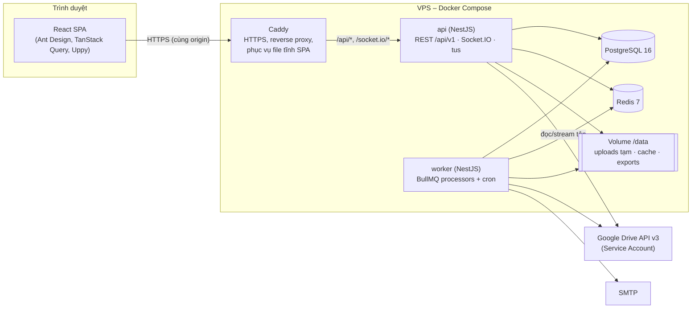

# EduPortfolio – Kiến trúc hệ thống (Architecture)

> Phiên bản 2.0 · 07/10/2026
> Tài liệu liên quan: [Requirement](Requirement.md) · [ModulesStructure](ModulesStructure.md) · [DatabaseDesign](DatabaseDesign.md)

---

## 1. Tiêu chí chọn công nghệ

Đây là đồ án tốt nghiệp: 1 người phát triển, khoảng 14 tuần, cần demo ổn định và dễ bảo vệ trước hội đồng. Thứ tự ưu tiên:

1. **Làm nhanh, ít lỗi**: một ngôn ngữ cho cả frontend và backend, thư viện UI có sẵn bảng/form/upload.
2. **Đáp ứng đúng nghiệp vụ khó**: ghi tệp lên Google Drive có thử lại, tác vụ định kỳ, real-time, tìm kiếm tiếng Việt không dấu.
3. **Ít thành phần hạ tầng**: chạy được trên 1 VPS bằng Docker Compose.
4. **Dễ giải thích**: kiến trúc phân lớp rõ, mỗi module ứng với một nhóm use case.

## 2. Công nghệ được chọn

| Lớp | Công nghệ | Lý do chọn | Phương án đã cân nhắc |
|---|---|---|---|
| Ngôn ngữ | **TypeScript** (cả hai phía) | Dùng chung kiểu và schema kiểm tra dữ liệu giữa FE và BE | Java/C# cho BE: thêm một ngôn ngữ, chậm hơn khi làm một mình |
| Frontend | **React 19 + Vite 6** (SPA) | Mọi trang đều sau đăng nhập, không cần SEO/SSR; SPA build ra file tĩnh, Nginx phục vụ trực tiếp, không cần server Node cho FE | Next.js: SSR/RSC thêm độ phức tạp (2 lớp server, cookie, cache) mà không có lợi ích ở đây |
| UI kit | **Ant Design 5** (locale `vi_VN`) | Table lọc/sắp xếp/phân trang, Form, DatePicker, Upload, Tree, Steps có sẵn; hợp hệ thống nhiều màn hình quản trị | MUI, shadcn/ui: phải tự dựng nhiều bảng/form hơn |
| Routing | **React Router 7** (data router) | Route lồng nhau theo vai trò, loader và guard | TanStack Router |
| Gọi API & cache | **TanStack Query 5** + `ky` | Cache, refetch, optimistic update, xử lý trạng thái tải/lỗi | SWR, Redux Toolkit Query |
| State cục bộ | **Zustand** | Chỉ cần giữ phiên người dùng và đứa con đang chọn | Redux |
| Kiểm tra dữ liệu | **Zod** (gói `shared`) | Một schema dùng cho form FE và DTO BE | class-validator (chỉ dùng được ở BE) |
| Upload | **Uppy** + **tus** | Chia khối, tải tiếp, tiến trình, hủy, kéo thả, xem trước ảnh | Tự viết chunk upload |
| Trình xem ảnh | **yet-another-react-lightbox** (+ plugin Thumbnails, Zoom, Fullscreen, Counter) | Đủ Next/Prev, "3/12", phím, vuốt, zoom | Swiper |
| Video | `<video>` HTML5 + stream có `Range` từ API | Không cần thư viện; tua được | Video.js |
| Biểu đồ | **Recharts** | Khai báo bằng JSX, đủ các loại biểu đồ cần dùng | ECharts, Chart.js |
| Backend | **NestJS 11** (Node.js 22 LTS) | Module + DI tương ứng nhóm use case; Guard/Interceptor cho RBAC; tích hợp sẵn BullMQ, Schedule, WebSocket, Swagger | Express thuần (thiếu cấu trúc), Spring Boot |
| ORM | **Prisma 6** | Schema khai báo, migration, kiểu an toàn; `$queryRaw` cho truy vấn tìm kiếm/thống kê | TypeORM, Drizzle |
| CSDL | **PostgreSQL 16** + extension `unaccent`, `pg_trgm` | Dữ liệu quan hệ chặt; tìm gần đúng tiếng Việt không dấu bằng trigram, không cần Elasticsearch; JSONB cho log và cấu hình; partial unique index | MySQL (không có `unaccent`/partial index) |
| Hàng đợi & lịch | **BullMQ** trên **Redis 7** | Thử lại với backoff mũ, giới hạn tốc độ (quota Drive), job lặp theo cron, tách worker; Redis dùng thêm cho rate limit, cache, Socket.IO adapter | pg-boss (ít tính năng giới hạn tốc độ), `@nestjs/schedule` (không bền khi khởi động lại, không thử lại) |
| Real-time | **Socket.IO** (`@nestjs/websockets`) + Redis adapter | Đẩy thông báo, cập nhật bài chung nhóm; tự kết nối lại | SSE (một chiều, không có phòng) |
| Lưu tệp | **Google Drive API v3** (`googleapis`) qua **Service Account** | Theo yêu cầu: bài nộp nằm trong Drive của GV | – |
| Upload server | **@tus/server** + `@tus/file-store` | Server cho giao thức tus, lưu khối vào đĩa | Multer (không tải tiếp được) |
| Xử lý ảnh / kiểm tra tệp | **sharp** (thumbnail), **file-type** (magic bytes) | Nhanh, phổ biến | – |
| Email | **Nodemailer** qua SMTP (Brevo free 300 mail/ngày hoặc Gmail App Password) | Đơn giản | SendGrid |
| Excel / PDF | **ExcelJS**, **pdfmake** (font Roboto, có tiếng Việt) | Không cần trình duyệt headless | Puppeteer (nặng) |
| Auth | JWT (`@nestjs/jwt`) trong cookie httpOnly, **argon2** | Không lưu token trong JS; Argon2id là chuẩn hiện hành | Session lưu Redis |
| Tài liệu API | **@nestjs/swagger** (OpenAPI 3) | Tự sinh từ decorator | – |
| Log | **pino** (`nestjs-pino`) dạng JSON | Nhanh, có request-id | Winston |
| Test | **Vitest** (FE, unit BE), **Jest + Supertest** (e2e API), **Playwright** (E2E UI), **Testcontainers** (Postgres/Redis thật khi test) | Phủ từ unit tới luồng nghiệp vụ | – |
| Monorepo | **pnpm workspaces** | Chia sẻ gói `shared`; cài nhanh | Nx, Turborepo (thừa với quy mô này) |
| Chất lượng mã | ESLint, Prettier, Husky + lint-staged, TypeScript `strict` | – | – |
| Triển khai | **Docker Compose** trên 1 VPS Ubuntu 24.04 (2 vCPU / 4 GB RAM / 80 GB SSD), **Caddy** làm reverse proxy + HTTPS tự động | Ít cấu hình hơn Nginx + Certbot | Nginx, Kubernetes (thừa) |
| CI | **GitHub Actions**: lint → test → build image → đẩy GHCR → (thủ công) deploy | – | – |
| Giám sát | Healthcheck `/api/health`, **Uptime Kuma**, **Bull Board** (`/admin/queues`, chỉ Admin) | Đủ cho đồ án | Prometheus/Grafana |

## 3. Kiến trúc tổng thể

Kiểu kiến trúc: **Modular Monolith**, một codebase backend chạy thành **2 tiến trình**:

- `api`: HTTP REST + WebSocket + tus upload.
- `worker`: xử lý hàng đợi BullMQ và các job lặp (Bộ hẹn giờ).

Hai tiến trình dùng chung module nghiệp vụ, CSDL và Redis. Tách worker ra để việc upload Drive nặng hoặc lỗi không ảnh hưởng thời gian phản hồi API, và để có thể chạy nhiều worker khi cần.



**Cùng origin:** SPA và API cùng tên miền (`https://eduportfolio.example.vn` và `/api`), nên cookie `SameSite=Lax` hoạt động, không cần cấu hình CORS, và `` gửi kèm cookie tự động.

## 4. Kiến trúc phân lớp trong backend

```
Controller (HTTP/WS)       – nhận request, gọi Zod pipe, gắn Guard; không chứa nghiệp vụ
   │
Service (Application)      – nghiệp vụ, transaction, phát sự kiện nội bộ, kiểm tra quyền sở hữu qua Policy
   │
Policy                     – hàm thuần: canViewSubmission, canEditTopic...
   │
Repository (Prisma)        – truy cập dữ liệu; truy vấn phức tạp dùng $queryRaw có tham số
   │
Integration adapters       – GoogleDriveClient, MailClient, StorageService (đĩa cục bộ)
```

- **Sự kiện nội bộ** (`@nestjs/event-emitter`): ví dụ `submission.created` → listener của Notification gửi thông báo, listener của Realtime phát socket. Các module không gọi chéo trực tiếp với nhau cho phần việc phụ.
- **Outbox nhẹ:** job BullMQ chỉ được thêm vào hàng đợi **sau khi transaction commit** (`afterCommit` helper), để worker không đọc phải dữ liệu chưa tồn tại.
- **Cross-cutting:** `JwtAuthGuard` → `MustChangePasswordGuard` → `ProfileCompleteGuard` (SV) → `RolesGuard` → `ParentChildGuard` (PH) · `AuditInterceptor` (đánh dấu bằng decorator `@Audit('ACTION')`) · `ThrottlerGuard` (Redis) · `AllExceptionsFilter` (chuẩn hóa mã lỗi).

## 5. Thiết kế tích hợp Google Drive

### 5.1. Mô hình quyền

```
Google Cloud project của hệ thống
└── Service Account: eduportfolio-drive@<project>.iam.gserviceaccount.com   (khóa JSON để ở secret)

Shared Drive của trường / khoa (Google Workspace)
└── Thư mục gốc của GV  ← GV thêm SA làm "Content manager"
    └── <MaLHP>_<TenBaiTap>/ ...   ← hệ thống tạo và ghi
```

- Service Account không có dung lượng lưu trữ riêng. Tệp do SA tạo trong **Shared Drive** thuộc về Shared Drive, nên không lỗi `storageQuotaExceeded`. Vì vậy bắt buộc dùng Shared Drive (UC04.4 phát hiện bằng cách ghi thử).
- Mọi lời gọi API đều đặt `supportsAllDrives=true`, `includeItemsFromAllDrives=true`.
- **Phương án dự phòng** (khi trường không có Workspace, ghi ở [Plan_project](Plan_project.md#7-quản-lý-rủi-ro)): thêm chế độ OAuth của GV (`drive.file` scope, lưu refresh token đã mã hóa). Lớp `DriveClientFactory` trả client theo `lecturer_drive_links.auth_mode`, nên phần còn lại không phải sửa.

### 5.2. Luồng dữ liệu tệp

```
Tải lên:  Trình duyệt ──tus (chunk 5MB)──► api ──► /data/uploads/tus/<uploadId>
          POST /submissions ──► kiểm tra magic bytes ──► chuyển vào /data/pending/<submissionId>/
          ──► commit DB ──► job drive.upload-file ──► worker: resumable upload ──► Drive
          ──► SYNCED ──► chuyển tệp sang /data/cache (giữ 7 ngày) ──► job dọn dẹp

Xem:      GET /files/:id/content ──► kiểm tra quyền ──► có bản cục bộ? phục vụ từ đĩa (Range)
                                                   └► không: files.get(alt=media, Range) ──► pipe về client
Thumbnail: GET /files/:id/thumbnail?w=400 ──► cache đĩa /data/thumbs/<id>_400.webp, chưa có thì sinh bằng sharp
```

### 5.3. Giới hạn quota và chống lỗi

| Cơ chế | Cấu hình |
|---|---|
| Đồng thời của hàng đợi `drive` | 4 job / worker |
| Bộ giới hạn BullMQ | 8 job/giây toàn hệ thống |
| Thử lại tự động | 8 lần, backoff mũ bắt đầu 30 s |
| Phân loại lỗi | 429/5xx/ECONNRESET là tạm thời (thử lại); 401/403/404/`storageQuotaExceeded` là vĩnh viễn (`FAILED` + báo GV) |
| Idempotent | Upload kiểm tra `drive_file_id` trước; tạo thư mục kiểm tra `folder_id` trong DB và dùng khóa Redis `lock:folder:<key>` để hai job không tạo trùng |
| Xóa | Chuyển vào thùng rác (`trashed=true`) thay vì xóa vĩnh viễn |

## 6. Real-time

- Namespace `/ws`, xác thực bằng cookie access token khi handshake.
- Phòng: `user:<userId>` (thông báo), `group:<groupId>` (bài chung), `assignment:<id>:lecturer` (GV theo dõi tình trạng đồng bộ).
- Sự kiện server → client: `notification:new`, `submission:updated`, `file:sync-status`, `group:updated`.
- Client nhận sự kiện thì gọi `queryClient.invalidateQueries(...)`; socket chỉ báo có thay đổi, không chở dữ liệu nghiệp vụ.
- Redis adapter cho phép worker phát sự kiện (qua `@socket.io/redis-emitter`).

## 7. Bảo mật

| Chủ đề | Thiết kế |
|---|---|
| Mật khẩu | Argon2id (`memoryCost 19 MiB, timeCost 2`); chính sách ≥ 8 ký tự, có chữ và số |
| Token | Access JWT 15 phút (`sub, role, sid, childId?`), cookie `access_token`; refresh token ngẫu nhiên 256 bit, chỉ lưu hash SHA-256 trong `refresh_tokens`, cookie `refresh_token` với `Path=/api/v1/auth`, 7 ngày; mỗi lần refresh đổi token mới (rotation). Token cũ bị dùng lại thì thu hồi cả họ token (`family_id`) |
| Cookie | `HttpOnly; Secure; SameSite=Lax` |
| CSRF | SameSite=Lax + middleware kiểm tra header `Origin` khớp tên miền với mọi method ghi |
| Phân quyền | RBAC bằng `@Roles()` + Policy kiểm tra quyền sở hữu trong service; truy vấn danh sách luôn lọc theo phạm vi người dùng ở tầng repository |
| Rate limit | Đăng nhập 5/phút/IP+username; quên mật khẩu 3/giờ; nhập mã nhóm 10/phút; tìm kiếm DN 30/phút; mặc định 300/phút/người dùng |
| Upload | Chỉ người đã đăng nhập mới upload qua tus; giới hạn kích thước theo cấu hình; kiểm tra magic bytes; tên tệp được làm sạch; không bao giờ thực thi hay giải nén tệp |
| Header | `helmet`: CSP (`default-src 'self'; frame-src https://www.figma.com; img-src 'self' data: blob:`), HSTS, `X-Content-Type-Options` |
| Bí mật | `.env` / Docker secrets: `DATABASE_URL`, `JWT_SECRET`, `GOOGLE_SA_KEY_BASE64`, `SMTP_*`; không commit lên git |
| Dữ liệu cá nhân | DN chỉ nhận DTO `StudentPublicProfile` (không có trường nhạy cảm, kiểm thử bằng snapshot); log không ghi mật khẩu/token |
| Audit | `audit_logs` ghi đăng nhập, thao tác quản trị, sửa điểm, nộp/xóa bài, duyệt quyền DN |

## 8. Hiệu năng

- Index đúng cho các truy vấn nóng (xem [DatabaseDesign §5](DatabaseDesign.md#5-chỉ-mục-index)); index GIN trigram cho tìm kiếm.
- `students.cpa`, `topic_count` được lưu sẵn (cập nhật khi công bố điểm/nộp bài) để sắp xếp tìm kiếm DN không phải tính lại.
- Thống kê: truy vấn tổng hợp + cache Redis 5 phút.
- Ảnh luôn hiển thị qua thumbnail WebP; ảnh gốc chỉ tải khi mở trình chiếu (prefetch ảnh kế tiếp).
- Video: stream theo `Range` (chunk 1 MB), không tải trọn tệp.
- FE: tách bundle theo vai trò (`React.lazy` mỗi khu vực), Ant Design import theo component.
- Ước lượng tải: 500 người dùng đồng thời × ~1 request/5 s ≈ 100 rps, đủ cho 1 instance Node (tách worker riêng).

## 9. Triển khai

### 9.1. Docker Compose trên server (VPS)

| Service | Image | Cổng | Ghi chú |
|---|---|---|---|
| `caddy` | `caddy:2` | 80, 443 | Phục vụ `/srv/web` (build SPA), proxy `/api`, `/socket.io` |
| `api` | `ghcr.io/<user>/eduportfolio-api` | 3000 (nội bộ) | `node dist/main.js` |
| `worker` | cùng image | – | `node dist/worker.js` |
| `postgres` | `postgres:16-alpine` | nội bộ | Volume `pgdata`; dùng image có `unaccent` và `pg_trgm` (có sẵn trong contrib) |
| `redis` | `redis:7-alpine` | nội bộ | `appendonly yes` |
| `backup` | `prodrigestivill/postgres-backup-local` | – | `pg_dump` hằng ngày, giữ 30 bản |
| `uptime-kuma` | `louislam/uptime-kuma` | qua Caddy `/status` | Tùy chọn |

Volume `/data` gắn vào `api` và `worker` (chung): `uploads/tus`, `pending`, `cache`, `thumbs`, `exports`. Dung lượng dự kiến ≤ 30 GB nhờ job dọn dẹp.

### 9.2. Môi trường

| Môi trường | Mục đích | Ghi chú |
|---|---|---|
| `local` | Phát triển | `docker compose -f compose.dev.yml up` (postgres, redis, mailpit); chạy `pnpm dev` |
| `test` | CI | Testcontainers; Google Drive dùng **mock adapter** |
| `server` | Demo 31/10, chạy thử tháng 11, bảo vệ | Một VPS duy nhất, Shared Drive thật, dữ liệu seed (không có production riêng) |

### 9.3. Quy trình CI/CD

```
push/PR ─► GitHub Actions: pnpm install ─► lint + typecheck ─► unit test ─► e2e (Testcontainers)
        ─► build web (vite) + build api ─► docker build ─► push GHCR (nhánh main)
deploy (thủ công): ssh VPS ─► docker compose pull && docker compose up -d ─► prisma migrate deploy (container 1 lần)
```

## 10. Quyết định kiến trúc (ADR tóm tắt)

| # | Quyết định | Hệ quả |
|---|---|---|
| ADR-01 | Modular monolith, tách tiến trình worker | Đơn giản khi triển khai; tách thành service riêng sau này nếu cần |
| ADR-02 | SPA thay vì SSR | Không có server Node cho FE; trang đầu tải chậm hơn chút (chấp nhận được vì toàn trang nội bộ) |
| ADR-03 | Service Account + Shared Drive | GV phải dùng Shared Drive; dự phòng OAuth qua `DriveClientFactory` |
| ADR-04 | Nộp thành công khi server nhận đủ tệp, ghi Drive bất đồng bộ | Cần ổ đĩa tạm và cơ chế đồng bộ lại; SV không phải chờ Drive |
| ADR-05 | Tìm kiếm bằng PostgreSQL `pg_trgm` + `unaccent` | Không vận hành Elasticsearch; đủ nhanh với 10⁵ bản ghi |
| ADR-06 | Mọi truy cập tệp đi qua API proxy | Tốn băng thông VPS; đổi lại phân quyền chặt và ghi log được lượt xem của DN |
| ADR-07 | JWT trong cookie httpOnly, cùng origin | An toàn trước XSS đánh cắp token; cần phòng CSRF (đã có) |
| ADR-08 | Zod schema dùng chung FE/BE | Một nguồn quy tắc kiểm tra dữ liệu |
