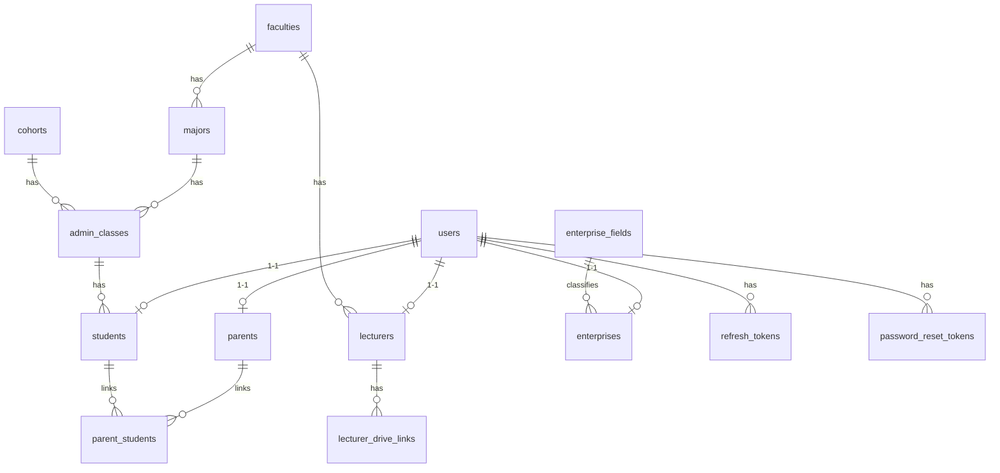
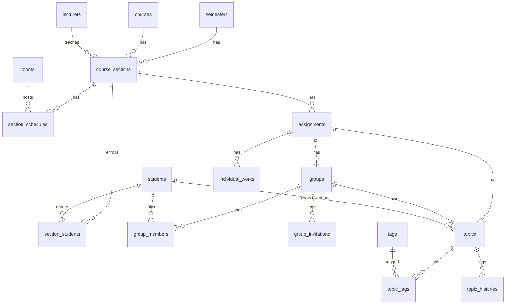
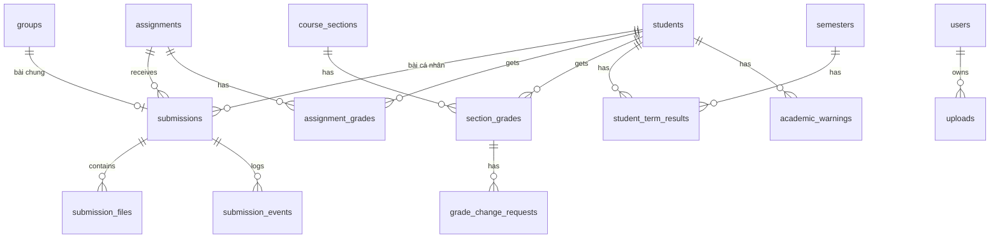
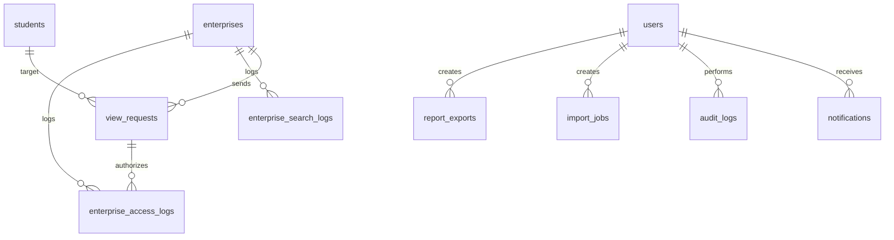

# EduPortfolio – Thiết kế cơ sở dữ liệu (Database Design)

> Phiên bản 2.0 · 07/10/2026 · PostgreSQL 16 · ORM Prisma 6
> Tài liệu liên quan: [Specification](Specification.md) · [Architecture](Architecture.md)

---

## 1. Quy ước

- Tên bảng/cột **snake_case**, tiếng Anh, bảng số nhiều. Prisma model PascalCase số ít, map bằng `@@map`.
- Khóa chính `id uuid DEFAULT gen_random_uuid()` (UUID v4); bảng nối dùng khóa chính kép.
- Mọi bảng nghiệp vụ có `created_at timestamptz DEFAULT now()`, `updated_at timestamptz` (Prisma `@updatedAt`).
- Xóa mềm bằng `deleted_at` chỉ dùng ở `assignments`, `submission_files`; các bảng khác xóa cứng hoặc dùng trạng thái.
- Tiền tố enum trong tài liệu: `enum_name(VALUE1|VALUE2)`.
- Điểm số `numeric(3,1)` (0,0–10,0); GPA `numeric(3,2)`.
- Extension cần bật: `pgcrypto`, `unaccent`, `pg_trgm`, `btree_gist`. Hàm bất biến dùng cho index:

```sql
CREATE OR REPLACE FUNCTION f_unaccent(text) RETURNS text
LANGUAGE sql IMMUTABLE PARALLEL SAFE STRICT AS
$$ SELECT lower(public.unaccent('public.unaccent'::regdictionary, $1)) $$;
```

## 2. Sơ đồ quan hệ (ERD)

### 2.1. Người dùng & hồ sơ



### 2.2. Đào tạo & bài tập



### 2.3. Nộp bài & điểm



### 2.4. Doanh nghiệp, thông báo, hệ thống



## 3. Danh sách bảng

| # | Bảng | Nhóm | Mô tả |
|---|---|---|---|
| 1 | `users` | Auth | Tài khoản đăng nhập mọi vai trò |
| 2 | `refresh_tokens` | Auth | Refresh token (hash), xoay vòng |
| 3 | `password_reset_tokens` | Auth | Token đặt lại mật khẩu |
| 4 | `faculties` | Danh mục | Khoa |
| 5 | `majors` | Danh mục | Ngành |
| 6 | `cohorts` | Danh mục | Khóa (K65…) |
| 7 | `admin_classes` | Danh mục | Lớp sinh hoạt |
| 8 | `rooms` | Danh mục | Phòng học |
| 9 | `enterprise_fields` | Danh mục | Lĩnh vực DN |
| 10 | `semesters` | Đào tạo | Học kỳ |
| 11 | `courses` | Đào tạo | Môn học + trọng số điểm |
| 12 | `course_sections` | Đào tạo | Lớp học phần |
| 13 | `section_schedules` | Đào tạo | Buổi học của LHP |
| 14 | `section_students` | Đào tạo | SV trong LHP |
| 15 | `lecturers` | Hồ sơ | GV |
| 16 | `students` | Hồ sơ | SV + hồ sơ + CPA lưu sẵn |
| 17 | `parents` | Hồ sơ | PH |
| 18 | `parent_students` | Hồ sơ | Liên kết PH – SV |
| 19 | `enterprises` | Hồ sơ | DN |
| 20 | `lecturer_drive_links` | Drive | Thư mục gốc Drive của GV |
| 21 | `assignments` | Bài tập | Bài tập |
| 22 | `groups` | Nhóm | Nhóm làm bài |
| 23 | `group_members` | Nhóm | Thành viên nhóm |
| 24 | `group_invitations` | Nhóm | Lời mời |
| 25 | `individual_works` | Nhóm | SV chọn làm cá nhân |
| 26 | `topics` | Đề tài | Đề tài của nhóm/SV |
| 27 | `tags` | Đề tài | Từ khóa |
| 28 | `topic_tags` | Đề tài | Đề tài – từ khóa |
| 29 | `topic_histories` | Đề tài | Lịch sử sửa đề tài |
| 30 | `uploads` | Nộp bài | Tệp đã tải qua tus, chưa gắn vào bài |
| 31 | `submissions` | Nộp bài | Bài nộp (chung / cá nhân) |
| 32 | `submission_files` | Nộp bài | Tệp của bài nộp |
| 33 | `submission_events` | Nộp bài | Lịch sử thao tác nộp |
| 34 | `assignment_grades` | Điểm | Điểm bài tập của từng SV |
| 35 | `section_grades` | Điểm | Điểm học phần |
| 36 | `grade_change_requests` | Điểm | Yêu cầu sửa điểm sau khóa |
| 37 | `student_term_results` | Điểm | GPA kỳ, CPA lưu sẵn |
| 38 | `academic_warnings` | Điểm | Cảnh báo học tập |
| 39 | `view_requests` | DN | Yêu cầu / quyền xem bài |
| 40 | `enterprise_search_logs` | DN | Lịch sử tìm kiếm |
| 41 | `enterprise_access_logs` | DN | Nhật ký DN xem hồ sơ/bài/tệp |
| 42 | `notifications` | Thông báo | Thông báo trong ứng dụng |
| 43 | `audit_logs` | Hệ thống | Nhật ký hệ thống |
| 44 | `system_settings` | Hệ thống | Cấu hình key–value |
| 45 | `import_jobs` | Hệ thống | Lịch sử import Excel |
| 46 | `report_exports` | Hệ thống | Báo cáo xuất nền |

## 4. Chi tiết bảng

Ký hiệu: **PK** khóa chính · **FK** khóa ngoại · **UQ** duy nhất · **NN** not null · *in nghiêng* = có thể null.

### 4.1. Auth

#### `users`
| Cột | Kiểu | Ràng buộc | Ghi chú |
|---|---|---|---|
| id | uuid | PK | |
| username | varchar(100) | NN, UQ (theo `lower(username)`) | `admin` / mã GV / MSSV / email DN / SĐT PH |
| password_hash | varchar(255) | NN | Argon2id |
| role | `user_role(ADMIN\|LECTURER\|STUDENT\|PARENT\|ENTERPRISE)` | NN | |
| status | `user_status(PENDING\|ACTIVE\|LOCKED\|REJECTED\|DISABLED)` | NN, mặc định `ACTIVE` | |
| must_change_password | boolean | NN, mặc định true | |
| failed_login_count | smallint | NN, 0 | |
| *locked_until* | timestamptz | | Khóa tạm |
| *email* | varchar(255) | | Email liên lạc / khôi phục (đồng bộ từ hồ sơ) |
| *last_login_at* | timestamptz | | |
| created_at, updated_at | timestamptz | | |

#### `refresh_tokens`
| Cột | Kiểu | Ràng buộc |
|---|---|---|
| id | uuid | PK |
| user_id | uuid | FK users, NN |
| token_hash | char(64) | NN, UQ |
| family_id | uuid | NN — chung cho chuỗi xoay vòng |
| expires_at | timestamptz | NN |
| *revoked_at* | timestamptz | |
| *replaced_by_id* | uuid | |
| *user_agent*, *ip* | text, inet | |
| created_at | timestamptz | |

#### `password_reset_tokens`
`id PK · user_id FK · token_hash char(64) UQ · expires_at · used_at? · created_at`

### 4.2. Danh mục

| Bảng | Cột |
|---|---|
| `faculties` | id, code varchar(20) UQ, name varchar(200), is_active |
| `majors` | id, faculty_id FK, code UQ, name, is_active |
| `cohorts` | id, code varchar(10) UQ (K65), start_year smallint, is_active |
| `admin_classes` | id, code UQ (65CNTT1), name, major_id FK, cohort_id FK, is_active |
| `rooms` | id, code UQ (A2-301), capacity smallint, is_active |
| `enterprise_fields` | id, name UQ (CNTT, Thiết kế, Marketing…), is_active |

### 4.3. Đào tạo

#### `semesters`
| Cột | Kiểu | Ràng buộc |
|---|---|---|
| id | uuid | PK |
| code | varchar(20) | UQ — `2026-2027-1` |
| academic_year | varchar(9) | NN — `2026-2027` |
| term | `term_type(TERM_1\|TERM_2\|SUMMER)` | NN |
| start_date, end_date | date | NN, `CHECK (end_date > start_date)` |
| is_current | boolean | Partial UQ `WHERE is_current` (chỉ 1 kỳ hiện tại) |

Chống chồng lấn: `EXCLUDE USING gist (daterange(start_date, end_date, '[]') WITH &&)` (cần `btree_gist`).

#### `courses`
| Cột | Kiểu | Ràng buộc |
|---|---|---|
| id | uuid | PK |
| code | varchar(20) | UQ |
| name | varchar(200) | NN |
| credits | smallint | `CHECK 1..10` |
| course_type | `course_type(DESIGN\|PROGRAMMING\|OTHER)` | NN |
| faculty_id | uuid | FK |
| w_attendance, w_assignment, w_midterm, w_final | smallint | NN, `CHECK (w_attendance + w_assignment + w_midterm + w_final = 100)` |
| is_active | boolean | |

#### `course_sections`
| Cột | Kiểu | Ràng buộc |
|---|---|---|
| id | uuid | PK |
| code | varchar(30) | UQ — `INT3306_1` |
| course_id | uuid | FK, NN |
| semester_id | uuid | FK, NN |
| lecturer_id | uuid | FK lecturers, NN |
| max_students | smallint | NN |
| *grades_published_at* | timestamptz | Khác null = bảng điểm đã khóa |
| created_at, updated_at | | |

#### `section_schedules`
| Cột | Kiểu | Ràng buộc |
|---|---|---|
| id | uuid | PK |
| section_id | uuid | FK, NN, ON DELETE CASCADE |
| day_of_week | smallint | `CHECK 2..8` (8 = CN) |
| period_start, period_end | smallint | `CHECK 1 ≤ start ≤ end ≤ 15` |
| room_id | uuid | FK rooms |

#### `section_students`
`section_id FK · student_id FK · enrolled_at · PK(section_id, student_id)`

### 4.4. Hồ sơ

#### `lecturers`
`id PK · user_id FK UQ · code varchar(20) UQ · full_name · faculty_id FK · email UQ · phone? · created_at · updated_at`

#### `students`
| Cột | Kiểu | Ràng buộc | Ghi chú |
|---|---|---|---|
| id | uuid | PK | |
| user_id | uuid | FK UQ | |
| student_code | varchar(20) | UQ | MSSV |
| full_name | varchar(100) | NN | |
| date_of_birth | date | NN | |
| gender | `gender(MALE\|FEMALE\|OTHER)` | | |
| admin_class_id | uuid | FK | Suy ra ngành, khóa |
| major_id, cohort_id | uuid | FK | Lưu sẵn để lọc nhanh |
| *phone* | varchar(10) | UQ | |
| *email* | varchar(255) | UQ | Email nhận thông báo |
| *father_phone*, *mother_phone*, *guardian_phone* | varchar(10) | | `CHECK` khác `phone` |
| *no_parent_reason* | varchar(255) | | Khi không khai số PH nào |
| *profile_completed_at* | timestamptz | | Null = chưa khai báo |
| discoverable | boolean | NN, false | Cho DN tìm thấy |
| *avatar_path* | text | | Ảnh lưu cục bộ `/data/avatars` |
| *bio* | varchar(1000) | | |
| skills | text[] | mặc định `{}` | |
| *github_url*, *behance_url*, *linkedin_url* | varchar(255) | | |
| *cpa* | numeric(3,2) | | Lưu sẵn |
| credits_earned | smallint | 0 | |
| topic_count | smallint | 0 | Số đề tài có bài đã nộp, lưu sẵn |
| search_text | text | | `f_unaccent(full_name ‖ skills ‖ tên đề tài ‖ tags)`, cập nhật khi đổi |

#### `parents`
`id PK · user_id FK UQ · phone varchar(10) UQ · full_name? · email? · created_at · updated_at`

#### `parent_students`
| Cột | Kiểu | Ràng buộc |
|---|---|---|
| parent_id | uuid | FK |
| student_id | uuid | FK |
| relation | `parent_relation(FATHER\|MOTHER\|GUARDIAN)` | |
| created_at | timestamptz | |
| | | PK(parent_id, student_id, relation); UQ(student_id, relation) |

#### `enterprises`
| Cột | Kiểu | Ràng buộc |
|---|---|---|
| id | uuid | PK |
| user_id | uuid | FK UQ |
| name | varchar(200) | NN |
| tax_code | varchar(13) | UQ |
| email | varchar(255) | UQ |
| contact_name, contact_phone | varchar | NN |
| field_id | uuid | FK enterprise_fields |
| *website*, *address* | varchar | |
| *reviewed_by* | uuid | FK users |
| *reviewed_at* | timestamptz | |
| *reject_reason* | varchar(500) | |

Trạng thái duyệt dùng `users.status` (`PENDING`/`ACTIVE`/`REJECTED`/`LOCKED`).

### 4.5. Drive

#### `lecturer_drive_links`
| Cột | Kiểu | Ràng buộc |
|---|---|---|
| id | uuid | PK |
| lecturer_id | uuid | FK, UQ (mỗi GV 1 thư mục gốc đang dùng) |
| auth_mode | `drive_auth_mode(SERVICE_ACCOUNT\|OAUTH)` | mặc định `SERVICE_ACCOUNT` |
| root_folder_id | varchar(100) | NN |
| root_folder_url | text | NN |
| root_folder_name | varchar(255) | |
| *shared_drive_id* | varchar(100) | |
| status | `drive_link_status(OK\|NO_PERMISSION\|NOT_FOUND\|NOT_SHARED_DRIVE\|QUOTA_EXCEEDED)` | |
| *oauth_refresh_token_enc* | text | Mở rộng — mã hóa AES-256-GCM |
| checked_at | timestamptz | |

### 4.6. Bài tập, nhóm, đề tài

#### `assignments`
| Cột | Kiểu | Ràng buộc | Ghi chú |
|---|---|---|---|
| id | uuid | PK | |
| section_id | uuid | FK, NN | |
| title | varchar(200) | NN | |
| *description* | text | | HTML đã làm sạch |
| work_mode | `work_mode(INDIVIDUAL\|GROUP\|CHOICE)` | NN | |
| *min_members*, *max_members* | smallint | `CHECK 1 ≤ min ≤ max ≤ 10` | Null nếu INDIVIDUAL |
| product_types | `product_type[]` | NN | `IMAGE, FIGMA, VIDEO, SOURCE, GIT_LINK` |
| open_at | timestamptz | NN | |
| due_at | timestamptz | NN, `CHECK due_at > open_at` | |
| allow_late | boolean | false | |
| *late_due_at* | timestamptz | `CHECK late_due_at > due_at` | |
| late_penalty_percent | smallint | 0, `CHECK 0..100` | |
| weight | smallint | 1 | Trọng số trong cột điểm bài tập |
| status | `assignment_status(DRAFT\|OPEN\|CLOSED)` | NN | |
| drive_parent_folder_id | varchar(100) | NN | Thư mục nhận bài GV chọn |
| drive_folder_id | varchar(100) | NN | `<MaLHP>_<TenBaiTap>` |
| *drive_migration_status* | `migration_status(RUNNING\|DONE\|FAILED)` | | UC04.6 |
| *deadline_processed_at* | timestamptz | | Bộ hẹn giờ đã khóa nhóm |
| created_by | uuid | FK lecturers | |
| *deleted_at* | timestamptz | | |
| created_at, updated_at | | | |

#### `groups`
| Cột | Kiểu | Ràng buộc |
|---|---|---|
| id | uuid | PK |
| assignment_id | uuid | FK, NN |
| seq | smallint | NN; UQ(assignment_id, seq) → `Nhom01` |
| name | varchar(50) | NN; UQ(assignment_id, lower(name)) |
| leader_id | uuid | FK students |
| invite_code | char(8) | UQ |
| invite_code_active | boolean | true |
| status | `group_status(OPEN\|LOCKED)` | |
| *locked_at* | timestamptz | |
| *locked_by* | uuid | FK users, null = hệ thống |
| *lock_reason* | `lock_reason(DEADLINE\|LECTURER\|CLOSED)` | |
| *drive_folder_id*, *drive_shared_folder_id* | varchar(100) | Thư mục nhóm, `Bai_chung` |
| created_at, updated_at | | |

#### `group_members`
| Cột | Kiểu | Ràng buộc |
|---|---|---|
| group_id | uuid | FK, ON DELETE CASCADE |
| student_id | uuid | FK |
| assignment_id | uuid | FK (lưu thừa để ràng buộc) |
| role | `member_role(LEADER\|MEMBER)` | |
| joined_at | timestamptz | |
| *drive_personal_folder_id* | varchar(100) | |
| | | PK(group_id, student_id); **UQ(assignment_id, student_id)** — BR-07 |

#### `group_invitations`
`id PK · group_id FK · inviter_id FK students · invitee_id FK students · status invitation_status(PENDING|ACCEPTED|DECLINED|CANCELLED|EXPIRED) · expires_at · responded_at? · created_at`
Partial UQ `(group_id, invitee_id) WHERE status='PENDING'`.

#### `individual_works`
`assignment_id FK · student_id FK · drive_folder_id? · created_at · PK(assignment_id, student_id)`
Service bảo đảm SV không đồng thời có `individual_works` và `group_members` trong cùng bài tập.

#### `topics`
| Cột | Kiểu | Ràng buộc |
|---|---|---|
| id | uuid | PK |
| assignment_id | uuid | FK, NN |
| *group_id* | uuid | FK |
| *student_id* | uuid | FK — khi làm cá nhân |
| title | varchar(200) | NN, `CHECK length ≥ 5` |
| *description* | varchar(1000) | |
| *technologies* | varchar(200) | |
| search_text | text | `f_unaccent(title ‖ description ‖ technologies ‖ tags)` |
| created_by, updated_by | uuid | FK users |
| created_at, updated_at | | |
| | | `CHECK (num_nonnulls(group_id, student_id) = 1)`; UQ(assignment_id, group_id); UQ(assignment_id, student_id) |

#### `tags`
`id PK · name varchar(50) · normalized_name varchar(50) UQ · merged_into_id? FK tags · is_hidden boolean · created_by? · created_at`

#### `topic_tags`
`topic_id FK CASCADE · tag_id FK · PK(topic_id, tag_id)`

#### `topic_histories`
`id PK · topic_id FK CASCADE · editor_id FK users · old_data jsonb · new_data jsonb · created_at`

### 4.7. Nộp bài

#### `uploads`
| Cột | Kiểu | Ghi chú |
|---|---|---|
| id | varchar(64) | PK — tus upload id |
| user_id | uuid | FK — chỉ chủ upload mới gắn được vào bài |
| original_name | varchar(255) | |
| size_bytes | bigint | |
| *detected_mime* | varchar(100) | Điền sau khi hoàn tất |
| local_path | text | |
| status | `upload_status(UPLOADING\|COMPLETED\|CONSUMED\|EXPIRED)` | |
| expires_at | timestamptz | now + 24h; job dọn tệp chưa dùng |

#### `submissions`
| Cột | Kiểu | Ràng buộc | Ghi chú |
|---|---|---|---|
| id | uuid | PK | |
| assignment_id | uuid | FK, NN | |
| kind | `submission_kind(GROUP_SHARED\|PERSONAL)` | NN | |
| *group_id* | uuid | FK | Với GROUP_SHARED |
| *student_id* | uuid | FK | Chủ bài PERSONAL |
| *topic_id* | uuid | FK | Đề tài tại thời điểm nộp |
| last_submitted_by | uuid | FK students | |
| *figma_url*, *git_url* | varchar(500) | | |
| *note* | varchar(2000) | | |
| version | integer | 1 | Tăng mỗi lần nộp lại |
| submitted_at | timestamptz | NN | |
| is_late | boolean | false | |
| status | `submission_status(SUBMITTED\|LATE\|GRADED\|RETURNED)` | NN | |
| sync_status | `sync_summary(PENDING\|SYNCED\|ERROR)` | NN | |
| *score* | numeric(3,1) | | Điểm gốc |
| *effective_score* | numeric(3,1) | | Sau trừ nộp muộn |
| *feedback* | text | | |
| *graded_by* | uuid | FK lecturers | |
| *graded_at* | timestamptz | | |
| *return_reason* | text | | |
| *resubmit_due_at* | timestamptz | | |
| created_at, updated_at | | | |
| | | `CHECK ((kind='GROUP_SHARED' AND group_id IS NOT NULL AND student_id IS NULL) OR (kind='PERSONAL' AND student_id IS NOT NULL AND group_id IS NULL))` | |
| | | Partial UQ `(assignment_id, group_id) WHERE kind='GROUP_SHARED'` · Partial UQ `(assignment_id, student_id) WHERE kind='PERSONAL'` | BR-10 |

#### `submission_files`
| Cột | Kiểu | Ghi chú |
|---|---|---|
| id | uuid | PK |
| submission_id | uuid | FK CASCADE |
| file_type | `file_type(IMAGE\|VIDEO\|SOURCE)` | |
| original_name | varchar(255) | |
| mime_type | varchar(100) | Đã kiểm tra bằng magic bytes |
| size_bytes | bigint | |
| sha256 | char(64) | |
| sort_order | smallint | Thứ tự ảnh |
| *drive_file_id* | varchar(100) | |
| *drive_md5* | char(32) | |
| *local_path* | text | Bản tạm/cache |
| sync_status | `file_sync_status(PENDING\|UPLOADING\|SYNCED\|FAILED\|MISSING)` | |
| retry_count | smallint | 0 |
| *next_retry_at* | timestamptz | |
| *last_error* | text | |
| uploaded_by | uuid | FK students |
| *deleted_at* | timestamptz | Ẩn ngay khi nộp lại / xóa |
| created_at, updated_at | | |

#### `submission_events`
| Cột | Kiểu | Ghi chú |
|---|---|---|
| id | uuid | PK |
| assignment_id | uuid | FK — giữ được khi bài nộp đã bị xóa |
| *submission_id* | uuid | FK `ON DELETE SET NULL` |
| kind | submission_kind | |
| *group_id*, *student_id* | uuid | Chủ bài |
| actor_id | uuid | FK users |
| action | `submission_action(SUBMIT\|RESUBMIT\|DELETE_FILES\|GRADE\|RETURN\|SYNC_FAILED)` | |
| version | integer | |
| detail | jsonb | `{added:[{name,size}], removed:[...], score?, reason?}` |
| created_at | timestamptz | |

### 4.8. Điểm

#### `assignment_grades`
| Cột | Kiểu | Ràng buộc |
|---|---|---|
| assignment_id | uuid | FK |
| student_id | uuid | FK |
| *submission_id* | uuid | FK |
| score | numeric(3,1) | NN |
| is_override | boolean | false |
| *note* | varchar(500) | |
| graded_by | uuid | FK lecturers |
| graded_at | timestamptz | |
| | | PK(assignment_id, student_id) |

#### `section_grades`
| Cột | Kiểu | Ràng buộc |
|---|---|---|
| id | uuid | PK |
| section_id | uuid | FK |
| student_id | uuid | FK |
| *attendance*, *assignment*, *midterm*, *final* | numeric(3,1) | `CHECK 0..10` |
| *total* | numeric(3,1) | Tính ở service |
| *letter* | varchar(2) | A, B+, … F |
| *gpa4* | numeric(2,1) | |
| status | `grade_status(DRAFT\|PUBLISHED)` | |
| updated_by | uuid | FK users |
| updated_at | timestamptz | |
| | | UQ(section_id, student_id) |

#### `grade_change_requests`
| Cột | Kiểu | Ghi chú |
|---|---|---|
| id | uuid | PK |
| section_grade_id | uuid | FK |
| lecturer_id | uuid | FK |
| old_values | jsonb | `{attendance, assignment, midterm, final, total}` |
| new_values | jsonb | Chỉ các thành phần cần sửa |
| reason | varchar(1000) | |
| *evidence_path* | text | |
| status | `request_status(PENDING\|APPROVED\|REJECTED\|CANCELLED)` | Partial UQ `(section_grade_id) WHERE status='PENDING'` |
| *processed_by* | uuid | FK users (Admin) |
| *processed_at* | timestamptz | |
| *admin_note* | varchar(500) | |
| created_at | timestamptz | |

#### `student_term_results`
`student_id FK · semester_id FK · gpa4 numeric(3,2) · credits smallint · cpa4 numeric(3,2) (tính đến hết kỳ) · cumulative_credits smallint · computed_at · PK(student_id, semester_id)`

#### `academic_warnings`
| Cột | Kiểu | Ghi chú |
|---|---|---|
| id | uuid | PK |
| student_id | uuid | FK |
| type | `warning_type(OVERDUE_SUBMISSION\|LOW_COURSE_SCORE\|LOW_GPA\|GPA_DROP)` | |
| message | varchar(500) | |
| *ref_type*, *ref_id* | varchar, uuid | assignment / section / semester |
| dedupe_key | varchar(150) | UQ |
| created_at | timestamptz | |

### 4.9. Doanh nghiệp

#### `view_requests`
| Cột | Kiểu | Ghi chú |
|---|---|---|
| id | uuid | PK |
| enterprise_id | uuid | FK |
| student_id | uuid | FK |
| purpose | varchar(500) | |
| requested_days | smallint | `CHECK 14..28` (theo cấu hình) |
| status | `view_request_status(PENDING\|APPROVED\|REJECTED\|EXPIRED\|REVOKED\|CANCELLED)` | |
| *approved_days* | smallint | |
| *approved_at*, *expires_at* | timestamptz | |
| *processed_by* | uuid | FK users |
| *reject_reason* | varchar(500) | |
| *revoked_at* | timestamptz | |
| *revoked_by* | uuid | |
| *revoke_reason* | varchar(500) | |
| created_at, updated_at | | |
| | | Partial UQ `(enterprise_id, student_id) WHERE status IN ('PENDING','APPROVED')` |

#### `enterprise_search_logs`
`id PK · enterprise_id FK · scope search_scope(STUDENT|SUBMISSION) · criteria jsonb · result_count int · created_at`

#### `enterprise_access_logs`
`id PK · enterprise_id FK · student_id FK · view_request_id? FK · action access_action(VIEW_PROFILE|VIEW_SUBMISSION|VIEW_FILE) · submission_id? · file_id? · ip inet · user_agent text · created_at`

### 4.10. Thông báo & hệ thống

#### `notifications`
| Cột | Kiểu | Ghi chú |
|---|---|---|
| id | uuid | PK |
| user_id | uuid | FK |
| type | varchar(50) | Danh mục ở Specification §5 |
| title | varchar(200) | |
| *body* | varchar(1000) | |
| *link* | varchar(300) | Đường dẫn trong SPA |
| *data* | jsonb | |
| *dedupe_key* | varchar(150) | UQ(user_id, dedupe_key) |
| *read_at* | timestamptz | |
| created_at | timestamptz | |

#### `audit_logs`
`id bigserial PK · actor_id? FK users · action varchar(60) · entity_type varchar(40) · entity_id? varchar(64) · old_data? jsonb · new_data? jsonb · ip? inet · user_agent? · created_at`

#### `system_settings`
`key varchar(100) PK · value jsonb · updated_by? · updated_at`

#### `import_jobs`
`id PK · type import_type(STUDENTS|SECTION_STUDENTS|SECTION_GRADES) · file_name · status(PREVIEW|COMPLETED|FAILED) · total_rows · success_rows · error_rows · errors jsonb · result_path? · created_by · created_at`

#### `report_exports`
`id PK · report_type varchar(50) · format(XLSX|PDF) · filters jsonb · status(PENDING|DONE|FAILED) · file_path? · expires_at · created_by · created_at`

## 5. Chỉ mục (index)

| Bảng | Index | Phục vụ |
|---|---|---|
| users | UQ `lower(username)` | Đăng nhập |
| students | `(major_id, cohort_id)`; `cpa DESC NULLS LAST, topic_count DESC, student_code` `WHERE discoverable` | Tìm SV cho DN |
| students | GIN `search_text gin_trgm_ops` | Tìm theo kỹ năng/đề tài |
| section_schedules | `(day_of_week)` + join `course_sections(semester_id, lecturer_id)` | Kiểm tra trùng lịch |
| section_students | `(student_id)` | LHP của SV |
| assignments | `(section_id, status)`; `(status, due_at)`; `(status, late_due_at)` | Danh sách, Bộ hẹn giờ |
| group_members | `(student_id)` | Nhóm của SV |
| group_invitations | `(invitee_id, status)`; `(status, expires_at)` | Lời mời của tôi, job hết hạn |
| topics | GIN `search_text gin_trgm_ops`; `(assignment_id)` | Tìm bài, cảnh báo trùng |
| tags | GIN `normalized_name gin_trgm_ops` | Autocomplete |
| submissions | `(assignment_id, status)`; `(group_id)`; `(student_id)` | |
| submission_files | `(submission_id, sort_order) WHERE deleted_at IS NULL`; `(sync_status, next_retry_at)` | Hiển thị, đồng bộ lại |
| submission_events | `(assignment_id, group_id)`; `(assignment_id, student_id)` | Lịch sử |
| view_requests | `(status, expires_at)`; `(enterprise_id, status)`; `(student_id, status)` | Job hết hạn, kiểm tra quyền |
| enterprise_access_logs | `(student_id, created_at DESC)`; `(enterprise_id, created_at DESC)` | UC09.11, thống kê |
| notifications | `(user_id, created_at DESC)`; `(user_id) WHERE read_at IS NULL` | Chuông |
| audit_logs | `(created_at DESC)`; `(actor_id, created_at)`; `(entity_type, entity_id)` | Tra cứu |

## 6. Truy vấn mẫu

### 6.1. Kiểm tra trùng lịch (UC02.11)

```sql
SELECT cs.code, s2.day_of_week, s2.period_start, s2.period_end,
       CASE WHEN cs.lecturer_id = $lecturer THEN 'LECTURER' ELSE 'ROOM' END AS reason
FROM section_schedules s2
JOIN course_sections cs ON cs.id = s2.section_id
WHERE cs.semester_id = $semester
  AND cs.id <> $sectionId
  AND s2.day_of_week = $day
  AND int4range(s2.period_start, s2.period_end, '[]') && int4range($pStart, $pEnd, '[]')
  AND (cs.lecturer_id = $lecturer OR s2.room_id = $room);
```

### 6.2. Tìm SV cho DN (UC09.1)

```sql
SELECT s.id, s.full_name, s.student_code, s.cpa, s.topic_count, m.name AS major, c.code AS cohort
FROM students s
JOIN users u ON u.id = s.user_id AND u.status = 'ACTIVE'
JOIN majors m ON m.id = s.major_id
JOIN cohorts c ON c.id = s.cohort_id
WHERE s.discoverable
  AND ($majorIds::uuid[] IS NULL OR s.major_id = ANY($majorIds))
  AND ($cohortIds::uuid[] IS NULL OR s.cohort_id = ANY($cohortIds))
  AND ($cpaMin IS NULL OR s.cpa >= $cpaMin) AND ($cpaMax IS NULL OR s.cpa <= $cpaMax)
  AND ($q IS NULL OR s.search_text % f_unaccent($q) OR s.search_text ILIKE '%' || f_unaccent($q) || '%')
  AND ($tagIds::uuid[] IS NULL OR EXISTS (
        SELECT 1 FROM topics t
        JOIN topic_tags tt ON tt.topic_id = t.id
        JOIN submissions sb ON sb.topic_id = t.id
        LEFT JOIN group_members gm ON gm.group_id = t.group_id
        WHERE tt.tag_id = ANY($tagIds) AND (t.student_id = s.id OR gm.student_id = s.id)))
ORDER BY s.cpa DESC NULLS LAST, s.topic_count DESC, s.student_code
LIMIT 20 OFFSET $offset;
```

### 6.3. Cảnh báo trùng đề tài (UC05.7)

```sql
SELECT t.id, t.title, similarity(t.search_text, f_unaccent($title)) AS score
FROM topics t
JOIN assignments a ON a.id = t.assignment_id
WHERE a.section_id = $sectionId AND t.id <> COALESCE($topicId, '00000000-0000-0000-0000-000000000000')
  AND similarity(t.search_text, f_unaccent($title)) >= 0.6
ORDER BY score DESC LIMIT 5;
```

### 6.4. Thu hồi quyền hết hạn (UC09.10)

```sql
UPDATE view_requests SET status = 'EXPIRED', updated_at = now()
WHERE status = 'APPROVED' AND expires_at <= now()
RETURNING id, enterprise_id, student_id;
```

### 6.5. Tính GPA kỳ và CPA (BR-16)

```sql
WITH best AS (            -- môn học lại lấy lần điểm cao nhất
  SELECT DISTINCT ON (cs.course_id) cs.course_id, cs.semester_id, sg.gpa4, c.credits
  FROM section_grades sg
  JOIN course_sections cs ON cs.id = sg.section_id
  JOIN courses c ON c.id = cs.course_id
  WHERE sg.student_id = $studentId AND sg.status = 'PUBLISHED' AND sg.gpa4 IS NOT NULL
  ORDER BY cs.course_id, sg.gpa4 DESC
)
SELECT ROUND(SUM(gpa4 * credits) / NULLIF(SUM(credits), 0), 2) AS cpa, SUM(credits) AS credits
FROM best;
```
GPA kỳ: cùng công thức nhưng lấy mọi học phần đã công bố trong kỳ (không lọc "lần cao nhất").

## 7. Dữ liệu khởi tạo (seed)

| Dữ liệu | Số lượng (môi trường demo) |
|---|---|
| Admin | 1 (`admin` / mật khẩu từ biến môi trường) |
| Khoa / ngành / khóa / lớp SH / phòng | 2 / 4 / 3 / 8 / 10 |
| Lĩnh vực DN | 8 |
| Học kỳ | 3 (2 kỳ cũ đã có điểm, 1 kỳ hiện tại) |
| Môn học | 10 (4 Thiết kế, 4 Lập trình, 2 Khác) |
| GV / SV / PH | 6 / 120 / ~150 |
| LHP | 12 (kèm lịch học) |
| Bài tập / nhóm / bài nộp | 20 / 60 / 150 (tệp mẫu nhỏ) |
| DN | 5 (3 đã duyệt, 1 chờ, 1 từ chối) + 15 yêu cầu xem bài |
| `system_settings` | Giá trị mặc định ở Specification UC02.13 |

## 8. Sao lưu & lưu giữ

- `pg_dump` nén hằng ngày lúc 02:00, giữ 30 bản; sao chép thêm 1 bản/tuần ra ngoài VPS.
- `audit_logs`, `enterprise_access_logs`, `enterprise_search_logs`: giữ 2 năm (job dọn hằng tháng).
- `notifications` đã đọc quá 180 ngày bị xóa.
- `refresh_tokens` hết hạn quá 30 ngày, `password_reset_tokens` hết hạn bị xóa hằng ngày.
