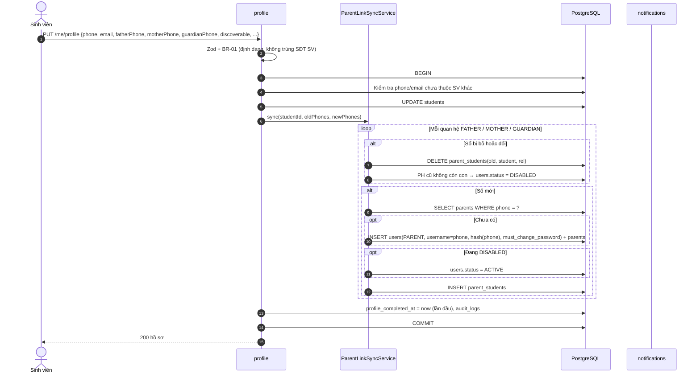
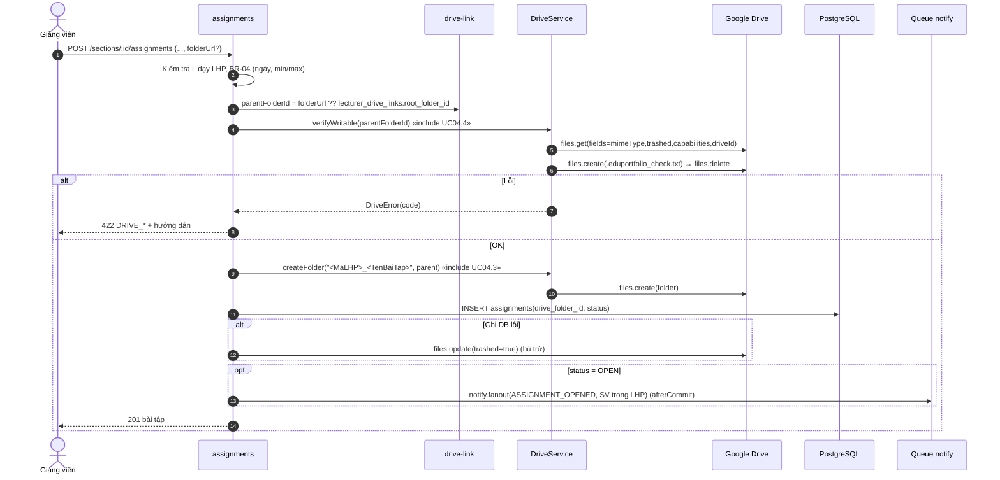
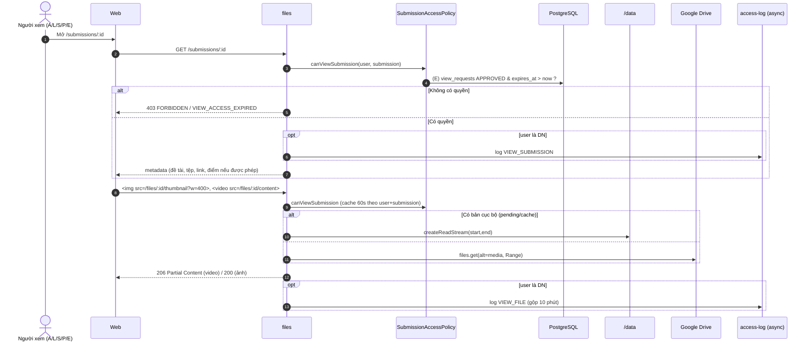
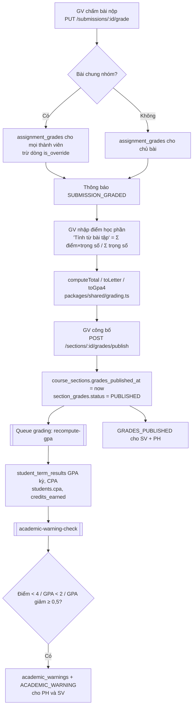
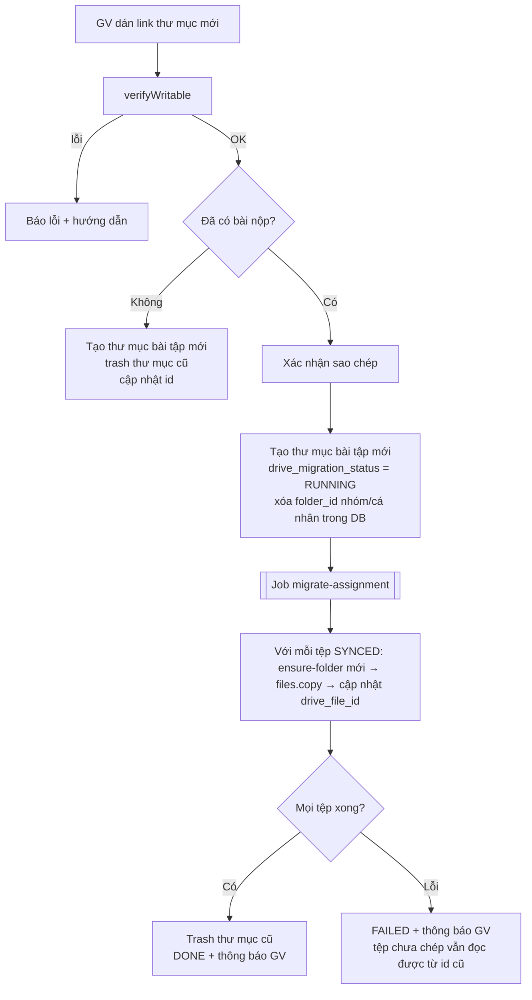
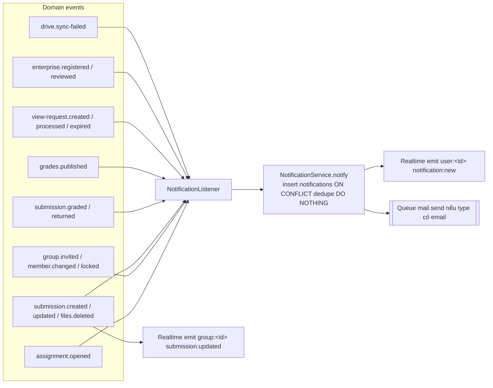

# EduPortfolio – Luồng xử lý giữa các module (Module Flows)

> Phiên bản 2.0 · 07/10/2026
> Mô tả luồng xử lý giữa các module cho những nghiệp vụ chính. Quy tắc chi tiết nằm ở [Specification](Specification.md), tên module theo [ModulesStructure](ModulesStructure.md).

---

## 1. Đăng nhập, làm mới token, cổng chặn

```mermaid
sequenceDiagram
  autonumber
  actor U as Người dùng
  participant W as Web SPA
  participant A as auth
  participant DB as PostgreSQL
  participant R as Redis

  U->>W: Nhập tên đăng nhập + mật khẩu (tab Tài khoản / Phụ huynh)
  W->>A: POST /auth/login
  A->>R: Kiểm tra rate limit (IP+username)
  A->>DB: Tìm users theo lower(username), role phù hợp tab
  alt Sai mật khẩu
    A->>DB: failed_login_count++ (lần 5 → locked_until)
    A-->>W: 401 AUTH_INVALID_CREDENTIALS
  else Đúng
    A->>DB: Tạo refresh_tokens(hash, family_id), reset bộ đếm
    A-->>W: Set-Cookie access_token, refresh_token + {user, mustChangePassword, profileCompleted, children[]}
  end
  W->>W: Điều hướng: đổi mật khẩu → khai báo hồ sơ (SV) / chọn con (PH) → trang chủ vai trò

  Note over W,A: Access token hết hạn
  W->>A: Gọi API → 401 AUTH_TOKEN_INVALID
  W->>A: POST /auth/refresh (cookie)
  A->>DB: Tìm token_hash; đã revoked? → thu hồi cả family, 401
  A->>DB: Revoke token cũ, tạo token mới (replaced_by_id)
  A-->>W: Cookie mới → W gọi lại request ban đầu (một lần)
```

**Thứ tự guard trên mọi request:** `JwtAuthGuard` → `MustChangePasswordGuard` (trừ `/auth/change-password`, `/auth/logout`, `/auth/me`) → `ProfileCompleteGuard` (SV, trừ `/me/profile`) → `RolesGuard` → `ParentChildGuard` (route `/parent/*`).

## 2. Khai báo hồ sơ & đồng bộ tài khoản phụ huynh (UC03.1, UC03.3)



## 3. Liên kết Drive & tạo bài tập (UC04.1–UC04.4)



Bài tập lưu ở `DRAFT` (ngày mở trong tương lai) sẽ được job `assignments.open-due` (mỗi phút) chuyển sang `OPEN` và gửi thông báo.

## 4. Nhóm: tạo, mời, tham gia (UC05.1–UC05.3)

```mermaid
sequenceDiagram
  autonumber
  actor S1 as SV (trưởng nhóm)
  actor S2 as SV được mời
  participant GR as groups
  participant DB as PostgreSQL
  participant QD as Queue drive
  participant N as notifications
  participant RT as realtime

  S1->>GR: POST /assignments/:id/groups {name}
  GR->>DB: BEGIN; kiểm tra S1 thuộc LHP, chưa có nhóm/individual_works
  GR->>DB: INSERT groups(seq, invite_code), group_members(LEADER); COMMIT
  GR->>QD: ensure-folder(group) (afterCommit)

  S1->>GR: POST /groups/:id/invitations {studentCode}
  GR->>DB: Kiểm tra cùng LHP, S2 chưa có nhóm, số TV + lời mời chờ < max
  GR->>DB: INSERT group_invitations(PENDING, expires_at)
  GR->>N: notify(S2, GROUP_INVITED, email)

  S2->>GR: POST /invitations/:id/accept
  GR->>DB: BEGIN; SELECT groups FOR UPDATE
  GR->>DB: Kiểm tra lại: nhóm OPEN, chưa đủ, S2 chưa có nhóm
  GR->>DB: INSERT group_members; invitation=ACCEPTED; CANCEL lời mời khác của S2 trong bài tập
  opt Nhóm đủ max
    GR->>DB: CANCEL mọi lời mời PENDING của nhóm
  end
  GR->>DB: COMMIT
  GR->>QD: ensure-folder(member personal)
  GR->>N: notify(trưởng nhóm, GROUP_INVITE_RESPONDED)
  GR->>RT: emit group:<id> group:updated
```

Tham gia bằng mã (`POST /groups/join`) đi theo nhánh "accept" nhưng không có lời mời.

## 5. Nộp bài & ghi lên Drive (UC06.1–UC06.4)

```mermaid
sequenceDiagram
  autonumber
  actor S as Sinh viên
  participant W as Web (Uppy)
  participant UP as uploads (tus)
  participant SB as submissions
  participant DB as PostgreSQL
  participant FS as /data
  participant QD as Queue drive
  participant WK as Worker
  participant G as Google Drive
  participant RT as realtime

  S->>W: Chọn tệp
  loop Mỗi tệp (chunk 5MB, tải tiếp được)
    W->>UP: POST/PATCH /uploads
    UP->>FS: ghi /data/uploads/tus/<id>
  end
  UP->>DB: uploads(status=COMPLETED, user_id)
  S->>W: Bấm "Nộp bài" (xác nhận nếu nộp lại)
  W->>SB: POST /assignments/:id/submissions {kind, uploadIds, figmaUrl, gitUrl, note, order}
  SB->>SB: Policy: thành viên/chủ bài, đề tài có, hạn nộp, chưa GRADED
  SB->>FS: Đọc magic bytes từng tệp (file-type) + kiểm tra size/số lượng
  SB->>DB: BEGIN
  SB->>DB: SELECT submission FOR UPDATE (nếu có)
  alt Nộp lần đầu
    SB->>DB: INSERT submissions(version=1)
  else Nộp lại «extend UC06.4»
    SB->>DB: UPDATE submission_files SET deleted_at=now (bản cũ); version++
  end
  SB->>FS: move uploads → /data/pending/<submissionId>/
  SB->>DB: INSERT submission_files(PENDING); uploads=CONSUMED
  SB->>DB: submitted_at=now, is_late, status, sync_status=PENDING
  SB->>DB: INSERT submission_events(SUBMIT|RESUBMIT)
  SB->>DB: COMMIT
  SB->>QD: upload-file × n, trash-file × (tệp cũ có drive_file_id)  (afterCommit)
  SB->>RT: emit group:<id> submission:updated
  SB-->>W: 201 "Nộp thành công – đang đồng bộ"

  QD->>WK: upload-file(fileId)
  WK->>DB: sync_status=UPLOADING
  WK->>WK: ensure-folder (khóa Redis) → folderId đích
  WK->>G: resumable upload (chunk 8MB)
  alt Thành công
    WK->>DB: drive_file_id, drive_md5, SYNCED; local_path → /data/cache
    opt Mọi tệp của bài SYNCED
      WK->>G: tạo/ghi đè thong_tin_bai_nop.txt
      WK->>DB: submissions.sync_status=SYNCED
    end
    WK->>RT: emit file:sync-status
  else Lỗi tạm thời
    WK-->>QD: throw → BullMQ thử lại (backoff mũ, tối đa 8)
  else Lỗi vĩnh viễn / hết lần thử
    WK->>DB: FAILED, last_error, next_retry_at; submissions.sync_status=ERROR
    WK->>DB: notify GV SUBMISSION_SYNC_FAILED / DRIVE_FOLDER_PROBLEM (gộp theo giờ)
  end
```

**Đường đi của tệp:** `uploads/tus` → `pending/<submissionId>` → (sau khi SYNCED) `cache/<fileId>` giữ 7 ngày → xóa. Tệp `FAILED` ở lại `pending` đến khi đồng bộ được.

## 6. Xem bài & stream tệp (UC06.7, UC09.5–UC09.6)



## 7. Doanh nghiệp xin quyền xem bài (UC09)

```mermaid
sequenceDiagram
  autonumber
  actor E as Doanh nghiệp
  actor AD as Admin
  participant EN as enterprise
  participant AC as access-control
  participant DB as PostgreSQL
  participant N as notifications
  participant CR as Bộ hẹn giờ

  E->>EN: GET /enterprise/students/search?...
  EN->>DB: Truy vấn §6.2 DatabaseDesign; INSERT enterprise_search_logs
  EN-->>E: Danh sách SV (CPA ↓) + đề tài
  E->>EN: GET /enterprise/students/:id  «extend»
  EN->>DB: INSERT enterprise_access_logs(VIEW_PROFILE)
  E->>EN: POST /enterprise/view-requests {studentIds, purpose, days}  «extend»
  EN->>DB: Bỏ qua SV có yêu cầu PENDING/APPROVED; INSERT view_requests(PENDING)
  EN->>N: notify Admin VIEW_REQUEST_CREATED

  AD->>AC: POST /admin/view-requests/approve {ids, days}
  AC->>DB: status=APPROVED, approved_at=now, expires_at=now+days
  AC->>N: notify DN + SV VIEW_REQUEST_PROCESSED

  E->>EN: GET /enterprise/students/:id/submissions → xem bài (§6)

  loop Mỗi 5 phút
    CR->>AC: expireDue()
    AC->>DB: UPDATE ... SET EXPIRED WHERE expires_at <= now RETURNING
    AC->>N: notify DN VIEW_REQUEST_EXPIRED
  end
  Note over CR,AC: 08:00 hằng ngày: còn ≤ 48h → VIEW_REQUEST_EXPIRING (dedupe)
```

## 8. Lịch tác vụ nền (Bộ hẹn giờ)

Đăng ký trong `scheduler` module dưới dạng **BullMQ repeatable jobs** (múi giờ `Asia/Ho_Chi_Minh`), chỉ chạy trong tiến trình `worker`. Mỗi job idempotent và dùng khóa Redis để không chạy chồng.

| Job | Lịch (cron) | Use case | Việc làm |
|---|---|---|---|
| `assignments.open-due` | `* * * * *` | UC04.2 | `DRAFT` có `open_at ≤ now` → `OPEN` + `ASSIGNMENT_OPENED` |
| `groups.lock-at-deadline` | `* * * * *` | UC05.10 | Bài tập quá hạn cuối, `deadline_processed_at IS NULL` → khóa nhóm, hủy lời mời, vô hiệu mã, cảnh báo nhóm thiếu người, `OVERDUE_SUBMISSION` cho PH |
| `invitations.expire` | `*/15 * * * *` | UC05.3 | `PENDING` quá `expires_at` → `EXPIRED` |
| `reminders.deadline` | `*/15 * * * *` | UC06.10 | Nhắc 24h / 2h cho SV chưa nộp (dedupe) |
| `drive.retry-failed` | `*/10 * * * *` | UC06.9 | Đưa lại tệp `FAILED` đến hạn thử |
| `drive.verify-files` | `0 3 * * *` | UC06.9 | Kiểm tra tệp còn trên Drive → `MISSING` |
| `drive.health-check` | `0 6 * * *` | UC04.4 | Kiểm tra thư mục bài tập đang mở còn quyền ghi → `DRIVE_FOLDER_PROBLEM` |
| `view-requests.expire` | `*/5 * * * *` | UC09.10 | `APPROVED` quá hạn → `EXPIRED` |
| `view-requests.expiring` | `0 8 * * *` | UC09.10 | Báo DN còn ≤ 48h |
| `maintenance.cleanup-uploads` | `0 * * * *` | – | Xóa `uploads` hết hạn chưa dùng + tệp tus mồ côi |
| `maintenance.cleanup-cache` | `30 3 * * *` | – | Xóa cache > 7 ngày, thumbnail > 30 ngày, báo cáo > 24h |
| `maintenance.purge-logs` | `0 4 1 * *` | – | Dọn log/thông báo/token cũ (DatabaseDesign §8) |
| `stats.warmup` | `0 5 * * *` | UC10 | Tính sẵn dashboard Admin vào cache |

## 9. Chấm điểm → công bố → GPA → cảnh báo (UC07, UC08.4)



## 10. Yêu cầu sửa điểm sau khi khóa (UC07.7–UC07.8)

```mermaid
sequenceDiagram
  autonumber
  actor L as Giảng viên
  actor AD as Admin
  participant GR as grading
  participant DB as PostgreSQL
  participant N as notifications
  participant Q as Queue grading

  L->>GR: POST /grade-change-requests {sectionGradeId, newValues, reason}
  GR->>DB: Kiểm tra LHP đã công bố, L phụ trách, chưa có PENDING
  GR->>DB: INSERT grade_change_requests(PENDING, old_values snapshot)
  GR->>N: notify Admin GRADE_CHANGE_REQUESTED
  AD->>GR: POST /admin/grade-change-requests/:id/approve
  GR->>DB: BEGIN; kiểm tra old_values = giá trị hiện tại (tránh ghi đè lệch)
  GR->>DB: UPDATE section_grades (tính lại total/letter/gpa4)
  GR->>DB: INSERT audit_logs(GRADE_CHANGED, old, new); status=APPROVED; COMMIT
  GR->>Q: recompute-gpa(studentId) → academic-warning-check
  GR->>N: notify GV + SV GRADE_CHANGE_PROCESSED
```

## 11. Đổi thư mục nhận bài khi đã có bài nộp (UC04.6)



Trong lúc migrate, SV nộp bài mới thì `ensure-folder` tạo thư mục trong cây mới, vì `folder_id` cũ đã bị xóa khỏi DB.

## 12. Luồng sự kiện nội bộ → thông báo


