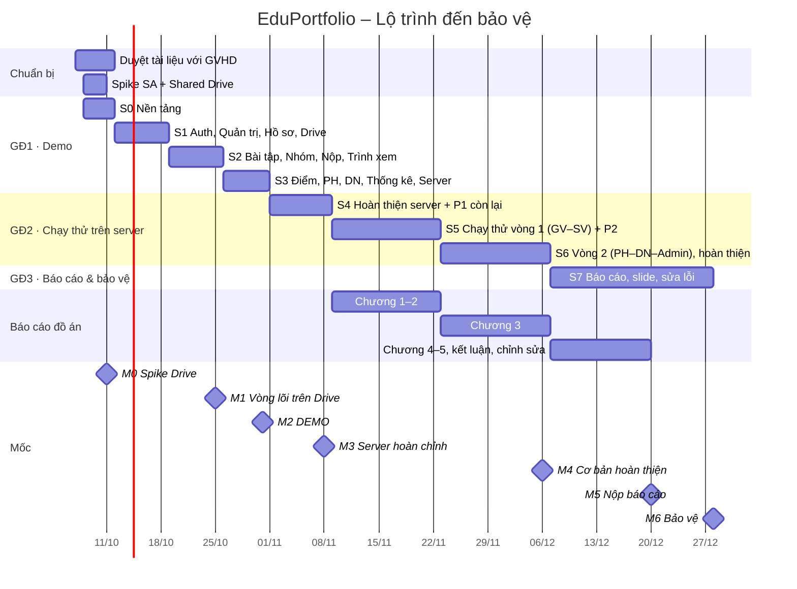

# EduPortfolio – Kế hoạch dự án (Project Plan)

> Phiên bản 2.1 · 07/10/2026 · **Lịch: demo xong 31/10 → tháng 11 chạy thử trên server thật → cơ bản hoàn thiện 06/12 → bảo vệ cuối tháng 12/2026**
> Tài liệu điều phối chung, liên kết tới: [Requirement](Requirement.md) · [Specification](Specification.md) · [Architecture](Architecture.md) · [DatabaseDesign](DatabaseDesign.md) · [ModulesStructure](ModulesStructure.md) · [ModuleFlows](ModuleFlows.md) · [TechTasks](TechTasks.md)

---

## 1. Tổng quan

| Mục | Nội dung |
|---|---|
| Tên đề tài | Hệ thống quản lý kết quả học tập đa phương tiện của sinh viên (EduPortfolio) |
| Loại | Đồ án tốt nghiệp – ứng dụng web |
| Người dùng | Admin, Giảng viên, Sinh viên, Phụ huynh, Doanh nghiệp |
| Phạm vi | 11 nhóm use case (UC01–UC11), khoảng 90 use case con |
| Công nghệ | React + Vite + Ant Design · NestJS + Prisma · PostgreSQL · Redis/BullMQ · Socket.IO · Google Drive API (Service Account) · Docker Compose |
| Thời gian | 08/10/2026 – bảo vệ cuối tháng 12/2026 (~12 tuần, 3 giai đoạn, 8 sprint) |
| Nguồn lực | 1 sinh viên thực hiện + trợ lý AI viết code; 1 giảng viên hướng dẫn (GVHD); 1 VPS làm server chạy thật |

### 1.1. Ba giai đoạn

| Giai đoạn | Thời gian | Kết quả phải có |
|---|---|---|
| **1. Xây dựng demo** | 08/10 – 31/10 | Bản demo chạy đủ luồng chính của 11 nhóm use case trên server thật (VPS, có HTTPS), dùng Shared Drive thật |
| **2. Chạy thử trên server thật** | 01/11 – 06/12 | Hoàn thiện P2 và kiểm thử toàn bộ hệ thống ngay trên server (dữ liệu seed, kịch bản theo vai trò), cộng test tự động, bảo mật, hiệu năng. **06/12: cơ bản hoàn thiện, đóng băng tính năng** |
| **3. Báo cáo & bảo vệ** | 07/12 – cuối 12 | Báo cáo đồ án, slide, video dự phòng; chỉ sửa lỗi |

### 1.2. Mục tiêu

1. **31/10:** demo đủ luồng chính (mục §3.1), chạy trên server thật với Drive thật.
2. **08/11:** server có CI tự deploy, email thật, dữ liệu kiểm thử đầy đủ.
3. **06/12:** đủ 11 nhóm use case (P1 + P2), đạt Definition of Done đầy đủ, không còn lỗi Nghiêm trọng/Cao.
4. Có số liệu chạy thử trên server (kết quả từng kịch bản, tỉ lệ đồng bộ Drive thành công, thời gian phản hồi, kết quả đo tải) để đưa vào chương 5 của báo cáo.
5. Test tự động: unit + API e2e (≥ 70% coverage ở service lõi) + 8 kịch bản E2E UI trước 06/12.

### 1.3. Sản phẩm bàn giao

| # | Sản phẩm | Hạn |
|---|---|---|
| D1 | Bộ tài liệu phân tích – thiết kế (thư mục `docs/`) | 11/10/2026 (bản 2.1), cập nhật liên tục |
| D2 | Mã nguồn monorepo trên GitHub (private, mời GVHD) | Liên tục |
| D3 | Bản demo trên server thật (URL HTTPS) + tài khoản demo | **31/10/2026** |
| D4 | Server hoàn chỉnh: CI tự deploy, email thật, backup | 08/11/2026 |
| D5 | Biên bản chạy thử trên server (kịch bản, kết quả, lỗi đã sửa, số liệu) | 06/12/2026 |
| D6 | Bản `v1.0.0-rc` (đóng băng) + hướng dẫn sử dụng + hướng dẫn cài đặt | **06/12/2026** |
| D7 | Báo cáo đồ án (Word/PDF) | Theo hạn của khoa (dự kiến ~20/12/2026) |
| D8 | Slide bảo vệ + video demo dự phòng | Trước ngày bảo vệ 3 ngày |

## 2. Giả định & ràng buộc

| # | Giả định / Ràng buộc | Nếu sai thì |
|---|---|---|
| A1 | Tháng 10 làm **~45 giờ/tuần** và dùng trợ lý AI cho phần code lặp lại; ước lượng 274 giờ thủ công rút xuống còn ~160 giờ thực tế | Áp dụng danh sách cắt giảm demo §3.3 ngay cuối S1 (18/10) |
| A2 | Có tài khoản Google Workspace (trường, hoặc bản dùng thử) để có **Shared Drive** trước 11/10 | Chuyển sang OAuth của GV (R1), demo vẫn giữ ngày |
| A3 | Có VPS (≥ 2 vCPU, 4 GB RAM) + tên miền trước 26/10 | Dùng máy cá nhân + Cloudflare Tunnel cho demo |
| A4 | Không cần môi trường production riêng hay người dùng thật; chạy được và kiểm thử đầy đủ trên server thật là đủ cho báo cáo | Nếu GVHD yêu cầu người dùng thật thì mời vài bạn cùng khóa đóng vai, vẫn trên server này |
| A5 | GVHD duyệt bộ tài liệu này làm phạm vi chính thức trước 11/10 | Cập nhật Requirement + TechTasks, đánh giá lại tiến độ |
| A6 | Điểm và GPA nhập tay, không tích hợp phần mềm đào tạo | – |
| A7 | Hạn nộp báo cáo khoảng 20/12, bảo vệ khoảng 28–31/12 | Chương 1–3 đã viết từ tháng 11 nên co lại được 1 tuần |

## 3. Phạm vi theo mốc

### 3.1. Có trong demo 31/10

| Nhóm | Phạm vi demo | Để sang tháng 11 |
|---|---|---|
| UC01 | Đăng nhập (2 kiểu), đổi mật khẩu lần đầu và thường, đăng xuất, đăng ký DN, PH chọn con | Quên mật khẩu |
| UC02 | Danh mục, học kỳ/môn, LHP + trùng lịch, tài khoản GV/SV, xếp SV (chọn tay), duyệt DN | Import Excel SV/LHP, quản lý PH + đổi SĐT, nhật ký, cấu hình (giao diện) |
| UC03 | Toàn bộ | – |
| UC04 | Liên kết Drive, tạo bài tập (kiểm tra quyền + tạo thư mục), sửa/đóng/xóa, SV xem bài tập | Đổi thư mục nhận bài, đổi tên thư mục, điều chỉnh nhóm đầy đủ |
| UC05 | Toàn bộ luồng SV; GV xem nhóm & đề tài, khóa nhóm; tự khóa khi hết hạn | GV thêm/chuyển thành viên, xuất Excel |
| UC06 | Nộp chung/cá nhân, ghi Drive, nộp lại, xóa nhiều tệp, trình xem ảnh/video/Figma, nhắc hạn | Real-time (demo dùng polling), lịch sử nộp, **tìm kiếm bài nộp**, đồng bộ lại định kỳ + trang tình trạng |
| UC07 | Chấm, ghi đè điểm thành viên, yêu cầu làm lại, nhập/công bố điểm, GPA/CPA, SV xem điểm | Excel bảng điểm, yêu cầu sửa điểm sau khóa + Admin xử lý |
| UC08 | Chọn con, điểm/GPA/CPA, bài nộp | Cảnh báo học tập |
| UC09 | Tìm SV, hồ sơ, gửi yêu cầu, trạng thái, Admin duyệt/từ chối/thu hồi, tự hết hạn, DN xem bài + nhật ký | SV xem DN đã xem mình |
| UC10 | Dashboard Admin, thống kê LHP | Thống kê DN, SV, DN mình, xuất báo cáo |
| UC11 | Chuông (polling), thông báo tự động trong ứng dụng | Email thật (demo dùng Mailpit), socket |

### 3.2. Hoàn thiện trong tháng 11 (đến 06/12)

Tất cả mục ở cột "Để sang tháng 11" + test e2e đầy đủ + bảo mật + hiệu năng + UI/UX theo lỗi phát hiện khi chạy thử. Chi tiết theo sprint ở [TechTasks](TechTasks.md) (S4–S6).

### 3.3. Thứ tự cắt giảm khi trễ

**Cho demo 31/10** (kiểm tra cuối S1 ngày 18/10 và cuối S2 ngày 25/10): nếu chậm hơn 20% thì đẩy sang tuần đầu tháng 11 lần lượt từ trên xuống:
1. T-603 Thống kê LHP (6h)
2. T-601 Dashboard Admin (6h); demo nói miệng phần thống kê
3. T-407 Job hạn nộp (4h); demo bằng nút "Đóng bài tập" thủ công
4. T-201a Xếp SV chọn tay (3h); seed sẵn SV vào LHP
5. T-109 phần giao diện xung đột lịch (giữ API + test)
6. T-504 rút gọn bộ lọc tìm SV (chỉ ngành, khóa, tag, CPA)

**Luồng không được cắt:** đăng nhập → hồ sơ + PH → Drive + bài tập → nhóm + đề tài → nộp bài → xem → chấm + công bố → PH xem → DN xin quyền và xem.

**Cho mốc 06/12** (nếu tháng 11 trễ): 1. Xuất PDF (giữ Excel) · 2. Đổi thư mục khi đã có bài nộp · 3. Thống kê DN chi tiết (giữ 5 chỉ số) · 4. `verify-files`/`health-check` · 5. Excel bảng điểm · 6. Cảnh báo `GPA_DROP`.

## 4. Phương pháp làm việc

- **Sprint 1 tuần** trong tháng 10 (nhịp nhanh để phát hiện trễ sớm), **sprint 1–2 tuần** từ tháng 11.
- **Bảng công việc:** GitHub Projects (*Backlog → Sprint → Đang làm → Review → Xong*); mỗi task ở [TechTasks](TechTasks.md) là một issue, nhãn `UC0x`, `P1/P2`, `be/fe/infra`, `server-test`.
- **Làm việc với trợ lý AI:** giao từng task kèm đường dẫn tới mục tài liệu tương ứng (Specification/DatabaseDesign/ModulesStructure); người thực hiện review code, chạy test, thử trên giao diện trước khi đánh dấu xong.
- **Mỗi tối Chủ nhật:** tự demo trên máy hoặc server, cập nhật burndown, quyết định cắt giảm nếu cần (§3.3).
- **GVHD:** gửi báo cáo tuần (mẫu §12.2) mỗi Chủ nhật trong tháng 10; họp trực tiếp 18/10, 31/10 (demo), 22/11, 06/12.
- **Nhánh git:** `main` luôn deploy được ← `feature/<task-id>-<mô-tả>`; server chạy bản `main` mới nhất. Người thực hiện tự commit.
- **Phiên bản:** `v0.1.0` (demo 31/10), `v0.2.x` (chạy thử tháng 11), `v1.0.0-rc` (06/12), `v1.0.0` (sau bảo vệ).

## 5. Lộ trình

### 5.1. Biểu đồ Gantt



### 5.2. Chi tiết từng sprint

#### Chuẩn bị (07/10 – 11/10)
- Gửi bộ tài liệu cho GVHD, chốt câu hỏi §13 (đặc biệt Q1, Q7).
- **Spike Drive (T-000), phải xong trước 11/10:** GCP project → Drive API → Service Account → Shared Drive → tải thử tệp 50 MB.

#### Giai đoạn 1 – Demo

| Sprint | Thời gian | Mục tiêu | Task | Tự kiểm cuối sprint |
|---|---|---|---|---|
| S0 | 08/10 – 11/10 | Khung dự án, schema đủ bảng | T-000 – T-007 | `pnpm dev` chạy; SA ghi được Drive |
| S1 | 12/10 – 18/10 | Đăng nhập mọi vai trò, dữ liệu nền, hồ sơ → PH, hạ tầng Drive | T-101–T-110 (trừ T-104), T-204, T-206, T-207, T-209, T-210 | SV khai báo hồ sơ thì PH đăng nhập được; **họp GVHD 18/10** |
| S2 | 19/10 – 25/10 | Vòng lõi trên Drive thật | T-211, T-212, T-301–T-306, T-308–T-310, T-401, T-403, T-404 | **M1:** giao bài → nhóm → đề tài → nộp → Drive → xem trình chiếu |
| S3 | 26/10 – 31/10 | Điểm, PH, DN, thống kê cơ bản, triển khai lên server | T-201a, T-407, T-408, T-409a, T-410, T-503a, T-504–T-507, T-601, T-603, T-609, T-311 | **M2 – DEMO 31/10** theo kịch bản §11 trên server |

#### Giai đoạn 2 – Chạy thử trên server thật

| Sprint | Thời gian | Mục tiêu | Task |
|---|---|---|---|
| S4 | 01/11 – 08/11 | CI tự deploy + email thật + import + tìm bài + sửa điểm; chuẩn bị dữ liệu và kịch bản chạy thử | T-008, T-703, T-111, T-201b, T-205, T-104, T-202, T-203, T-406, T-501, T-712 |
| S5 | 09/11 – 22/11 | **Chạy thử vòng 1** (vai GV + SV); real-time; độ bền Drive; P2; test e2e; báo cáo chương 1–2 | T-402, T-405, T-409b, T-502, T-503b, T-208, T-508, T-509, T-510, T-511, T-307, T-702, T-713a, T-706a |
| S6 | 23/11 – 06/12 | **Chạy thử vòng 2** (vai PH + DN + Admin); thống kê, báo cáo; bảo mật, hiệu năng, UI; E2E; báo cáo chương 3 | T-602, T-604 – T-608, T-610, T-701, T-705, T-713b, T-706b |

#### Giai đoạn 3 – Báo cáo & bảo vệ (07/12 – cuối 12)
- Chỉ sửa lỗi (T-714), không thêm tính năng.
- Hoàn thành báo cáo chương 4–5 (T-706c), nộp theo hạn khoa (~20/12).
- Slide, video dự phòng, bản chạy local (T-707); 2 lần tổng duyệt (T-715).

### 5.3. Kế hoạch chạy thử trên server thật (tháng 11)

Không dựng production riêng và không mời người dùng thật. Mọi thứ chạy trên **một VPS** (chính server dùng cho demo 31/10), với dữ liệu seed sát thực tế và Shared Drive thật. Người thực hiện tự đóng các vai bằng nhiều trình duyệt / cửa sổ ẩn danh; ở kịch bản nhóm có thể nhờ vài bạn đóng vai SV nếu muốn.

| Tuần | Thời gian | Vai | Hoạt động | Số liệu ghi lại |
|---|---|---|---|---|
| 0 | 01/11 – 08/11 | – | Bật CI tự deploy lên server, SMTP thật, backup; seed bộ dữ liệu kiểm thử (2 học kỳ, ~120 SV, 6 GV); viết checklist kịch bản theo §14 | – |
| 1–2 | 09/11 – 22/11 | GV, SV | Tạo 2 bài tập (1 nhóm, 1 cá nhân, có ảnh + video lớn); lập nhóm, mời, nộp, nộp lại, xóa ảnh; cố ý gây lỗi Drive (gỡ quyền SA) để kiểm tra giữ tạm và đồng bộ lại; chấm, công bố | Kết quả từng kịch bản (đạt/lỗi), tỉ lệ tệp `SYNCED` lần đầu, số lần thử lại, thời gian upload video 300–500 MB, p95 thời gian phản hồi |
| 3 | 23/11 – 29/11 | PH, DN, Admin | PH đăng nhập bằng SĐT, xem điểm/bài/cảnh báo; DN đăng ký → tìm → xin quyền → duyệt → xem → hết hạn (rút ngắn thời hạn); yêu cầu sửa điểm; thống kê, xuất báo cáo | Kết quả kịch bản; đối chiếu số liệu thống kê với truy vấn kiểm tra |
| 4 | 30/11 – 06/12 | Tất cả | Chạy lại 8 kịch bản E2E trên server; đo tải k6; sửa lỗi còn lại; chốt `v1.0.0-rc` | Biên bản chạy thử (D5) |

**Quy tắc khi chạy thử:** lỗi ghi thành issue nhãn `server-test`; backup DB trước mỗi lần deploy có migration; lưu ảnh chụp màn hình và số liệu cho chương 5.

## 6. Mốc kiểm soát

| Mốc | Ngày | Tiêu chí đạt | Nếu không đạt |
|---|---|---|---|
| M0 Spike Drive | 11/10 | SA tải được tệp 50 MB vào Shared Drive bằng resumable upload | Chuyển sang OAuth (R1), cộng 6–8h vào S1; báo GVHD |
| Kiểm S1 | 18/10 | Đăng nhập mọi vai trò, dữ liệu nền, hồ sơ → PH | Áp dụng cắt giảm demo §3.3 mục 1–2 |
| M1 | 25/10 | Vòng giao bài → nhóm → đề tài → nộp → Drive → xem chạy được | Cắt §3.3 mục 1–4; S3 chỉ còn điểm, PH, DN |
| **M2 DEMO** | **31/10** | Kịch bản §11 chạy trên server thật (trừ phần đã cắt giảm có ghi rõ) | Demo trên máy local; phần thiếu xong trong tuần 01–08/11 |
| M3 | 08/11 | CI tự deploy lên server, email thật, import, dữ liệu và checklist chạy thử sẵn sàng | Bắt đầu chạy thử muộn nhất 16/11 |
| **M4 Cơ bản hoàn thiện** | **06/12** | Đủ 11 nhóm UC; TC-01 – TC-20 xanh; 8 E2E xanh; không còn lỗi Nghiêm trọng/Cao; có biên bản chạy thử | Cắt theo §3.3 (mốc 06/12), phần còn lại ghi vào "hướng phát triển" |
| M5 | ~20/12 | Nộp báo cáo đồ án | – |
| M6 | ~28/12 | Bảo vệ | – |

## 7. Quản lý rủi ro

Thang điểm: Xác suất (X) và Ảnh hưởng (A) từ 1 đến 3; Mức = X × A.

| # | Rủi ro | X | A | Mức | Phòng ngừa | Ứng phó |
|---|---|---|---|---|---|---|
| R1 | Không có Shared Drive, SA không ghi được tệp vào My Drive (`storageQuotaExceeded`) | 2 | 3 | **6** | Spike M0 trước 11/10; xin tài khoản Workspace của trường; `DriveClientFactory` đã tách sẵn | Thêm chế độ OAuth của GV (scope `drive.file`), khoảng 6–8 giờ |
| R2 | **Không kịp demo 31/10** (274 giờ trong 3,5 tuần) | 3 | 3 | **9** | Sprint 1 tuần; kiểm burndown 18/10 và 25/10; dùng trợ lý AI cho CRUD/form/test; ưu tiên luồng không được cắt | Cắt theo §3.3; demo có ghi rõ phần đang làm; phần thiếu xong trước 08/11 |
| R4 | Deploy có migration làm hỏng dữ liệu chạy thử trên server | 1 | 2 | 2 | Backup trước mỗi deploy; thử migration trên DB local có dữ liệu seed trước | Khôi phục từ backup, seed lại |
| R5 | Quota/giới hạn tốc độ Drive API khi đo tải nhiều SV nộp cùng lúc | 2 | 2 | 4 | Hàng đợi có limiter, backoff, nộp bất đồng bộ | Tăng chu kỳ thử lại, phục vụ tệp từ bản cục bộ |
| R6 | Đầy ổ đĩa / băng thông VPS do video | 2 | 2 | 4 | Job dọn dẹp, cache 7 ngày, giới hạn video, cảnh báo Uptime Kuma | Giảm thời gian cache, nâng ổ đĩa, hạ giới hạn video |
| R7 | Lỗi bảo mật phân quyền (lộ bài cá nhân, DN xem quá hạn) trên server công khai | 2 | 3 | **6** | Policy tập trung + test bảng chân trị **trong tháng 10**; kiểm tra `expires_at > now()` ở mọi lần truy cập | Hotfix trong 24h, rà checklist T-607 |
| R8 | Nợ kỹ thuật từ tháng 10 (DoD rút gọn) làm tháng 11 chậm | 3 | 2 | **6** | Unit test cho logic lõi ngay từ tháng 10; T-702 bù e2e đầu S5 | Dành 1 ngày "trả nợ" sau mỗi vòng chạy thử |
| R9 | Báo cáo đồ án bị dồn vào tháng 12 | 2 | 3 | **6** | Viết chương 1–2 trong S5, chương 3 trong S6 | Rút gọn phụ lục; dùng sẵn sơ đồ từ `docs/` |
| R10 | Yêu cầu thay đổi từ GVHD | 2 | 2 | 4 | Chốt phạm vi (A5); phân loại yêu cầu trước khi làm | Chỉ nhận thay đổi nhỏ; còn lại ghi "hướng phát triển" |
| R11 | Race condition ở nhóm/nộp bài | 2 | 2 | 4 | `SELECT FOR UPDATE`, unique index, test song song | Sửa và thêm test hồi quy |
| R12 | Sự cố server ngày bảo vệ | 1 | 3 | 3 | Bản local Docker Compose + video demo | Chuyển sang bản local |
| R13 | Email bị chặn hoặc vào spam | 2 | 1 | 2 | SMTP có SPF/DKIM (Brevo) | Dựa vào thông báo trong ứng dụng |
| R14 | Lộ dữ liệu cá nhân trên server công khai | 1 | 2 | 2 | Chỉ dùng dữ liệu giả (họ tên, SĐT, email sinh ngẫu nhiên); HTTPS | Xóa và seed lại |

## 8. Kế hoạch kiểm thử

### 8.1. Các mức kiểm thử

| Mức | Công cụ | Phạm vi | Khi chạy |
|---|---|---|---|
| Unit | Vitest | `shared/grading`, policy, service thuần (sync PH, trùng lịch, GPA, ràng buộc nhóm) | Từ tháng 10, mỗi commit |
| Integration / API e2e | Jest + Supertest + Testcontainers, `FakeDriveService` | Mọi endpoint P1: thành công + ngoại lệ chính + phân quyền | Bù trong S4–S5 (T-702), sau đó mỗi PR |
| Drive thật | Script `pnpm test:drive` trên Shared Drive test | Tạo thư mục, upload resumable, trash, copy, lỗi quyền | Cuối S2, trước M3, trong S5 |
| E2E UI | Playwright | 8 kịch bản (T-701) | S6, chạy trực tiếp với URL server |
| Hiệu năng | k6 + dữ liệu giả 10⁴ SV / 10⁵ bài (DB riêng) | Tìm SV, tìm bài, xem bài, nộp bài | S6 |
| Bảo mật | Checklist OWASP ASVS L1 rút gọn, OWASP ZAP baseline | Auth, phân quyền, upload, header | S6 (rà quyền cơ bản trước M3) |
| **Chạy thử trên server** | Server thật, dữ liệu seed, checklist kịch bản | Toàn bộ use case theo §5.3 | 09/11 – 06/12 |

### 8.2. Ca kiểm thử trọng yếu (phải có test tự động)

| # | Ca kiểm thử | UC |
|---|---|---|
| TC-01 | Sai mật khẩu 5 lần thì bị khóa 15 phút; đúng mật khẩu khi đang khóa vẫn bị từ chối | 01.1 |
| TC-02 | Refresh token cũ bị dùng lại thì cả họ token bị thu hồi | 01.1 |
| TC-03 | Hai SV khai cùng SĐT mẹ thì có 1 tài khoản PH, 2 liên kết; một SV đổi số thì PH vẫn còn 1 con | 03.3 |
| TC-04 | LHP cùng GV, cùng thứ, tiết 3–5 với tiết 5–7 thì báo trùng; tiết 1–2 với 3–4 thì không trùng | 02.11 |
| TC-05 | Hai SV cùng chấp nhận lời mời vào chỗ cuối cùng: đúng 1 người thành công | 05.3 |
| TC-06 | SV không có đề tài thì không nộp được; quá hạn thì không nộp được; đã chấm thì không nộp lại được trừ khi GV trả bài | 06.1, 06.4 |
| TC-07 | Tệp `.jpg` có nội dung là `.exe` bị từ chối | 06.1 |
| TC-08 | Nộp lại thì tệp cũ ẩn ngay, job trash được tạo, `version` tăng, sự kiện ghi đủ tên tệp | 06.4 |
| TC-09 | Drive trả 403 thì tệp `FAILED`, bài vẫn "đã nộp", GV nhận thông báo; cấp lại quyền thì retry đưa tệp về `SYNCED` | 06.3, 06.9 |
| TC-10 | Bảng chân trị `canViewSubmission` cho 5 vai trò × 2 loại bài × các tình huống sở hữu | 06.7 |
| TC-11 | DN xem bài khi quyền còn 1 giây thì được; quá hạn 1 giây thì 403 dù job chưa chạy | 09.5 |
| TC-12 | DN không thể gửi yêu cầu thứ 2 khi yêu cầu cũ còn PENDING/APPROVED | 09.3 |
| TC-13 | Tìm SV: SV `discoverable=false` không xuất hiện; thứ tự CPA ↓, số đề tài ↓, MSSV ↑ | 09.1 |
| TC-14 | Response hồ sơ DN không chứa phone/email/parent/điểm chi tiết (snapshot) | 09.2 |
| TC-15 | Tính tổng kết, điểm chữ, hệ 4 đúng ở các mốc biên 3,95 / 4,0 / 8,45 / 8,5 | 07.4 |
| TC-16 | CPA lấy lần học cao nhất của môn học lại | 07.6 |
| TC-17 | Sửa điểm sau khóa: GV không PATCH trực tiếp được; Admin duyệt thì điểm đổi, có audit, CPA tính lại | 07.7, 07.8 |
| TC-18 | Bộ hẹn giờ qua hạn: nhóm khóa, lời mời hủy, mã mời vô hiệu, PH nhận cảnh báo SV chưa nộp; chạy lại không tạo trùng | 05.10, 06.10 |
| TC-19 | Nhắc hạn 24h gửi đúng 1 lần cho mỗi SV chưa nộp | 06.10 |
| TC-20 | PH chọn con A rồi gọi API xem bài của con B (không liên kết) thì 403 | 08.3 |

### 8.3. Tiêu chí kiểm thử đạt

- 100% ca TC-01 – TC-20 xanh.
- Coverage ≥ 70% ở `auth`, `profile`, `groups`, `submissions`, `files`, `grading`, `enterprise`, `access-control`.
- Không còn lỗi mức Nghiêm trọng/Cao tại M4 (06/12); lỗi mức Trung bình có ghi chú.
- NFR-01: p95 tìm SV < 3 s với 10⁴ SV; trang thông thường < 2 s.

## 9. Môi trường & chi phí

| Hạng mục | Lựa chọn | Chi phí tham khảo |
|---|---|---|
| VPS | 2 vCPU / 4 GB / 80 GB SSD (nhà cung cấp trong nước hoặc Hetzner/DigitalOcean); một server duy nhất từ 26/10 đến bảo vệ | ~150.000 – 250.000 đ/tháng × 3 tháng |
| Tên miền | `.id.vn` (miễn phí cho cá nhân 18–23 tuổi) hoặc `.com` | 0 – 300.000 đ/năm |
| Google Workspace | Tài khoản trường; nếu không có thì bản dùng thử Business Starter 14 ngày (không đủ cho cả tháng 11, xem R1) | 0 (nếu dùng tài khoản trường) |
| Google Cloud (Drive API) | Miễn phí trong hạn mức | 0 |
| Email | Brevo free (300 mail/ngày) | 0 |
| GitHub, Actions, GHCR | Gói miễn phí | 0 |
| **Tổng ước tính** | | **~0,5 – 1,1 triệu đồng** |

## 10. Khung báo cáo đồ án

| Chương | Nội dung | Nguồn tài liệu |
|---|---|---|
| Mở đầu | Lý do chọn đề tài, mục tiêu, phạm vi, phương pháp | Requirement §1–2, Plan §1 |
| 1. Cơ sở lý thuyết & công nghệ | Hệ thống quản lý học tập, e-portfolio; React, NestJS, PostgreSQL (trigram, unaccent), BullMQ, WebSocket, Google Drive API, JWT, RBAC | Architecture §2 |
| 2. Khảo sát & phân tích yêu cầu | Hiện trạng, tác nhân, 11 sơ đồ use case, đặc tả use case chính, yêu cầu phi chức năng, quy tắc nghiệp vụ | Requirement, Specification §6 |
| 3. Thiết kế hệ thống | Kiến trúc tổng thể, triển khai, tích hợp Drive, CSDL (ERD, bảng), sơ đồ tuần tự, máy trạng thái, thiết kế API, giao diện | Architecture, DatabaseDesign, ModuleFlows, ModulesStructure, Specification §4 |
| 4. Cài đặt | Cấu trúc mã nguồn, các điểm kỹ thuật nổi bật (đồng bộ Drive bất đồng bộ, upload tải tiếp, phân quyền, tìm kiếm không dấu, xử lý cạnh tranh), ảnh màn hình | ModulesStructure, TechTasks |
| 5. Kiểm thử & đánh giá | Chiến lược, kết quả test tự động, hiệu năng, **kết quả chạy thử trên server thật** (kịch bản, số liệu đồng bộ Drive, hiệu năng), đánh giá so với mục tiêu | Plan §5.3, §8 |
| Kết luận | Kết quả đạt được, hạn chế, hướng phát triển | Requirement §9 |

## 11. Kịch bản demo bảo vệ (15 phút)

| Phút | Vai trò | Nội dung |
|---|---|---|
| 0–1 | – | Giới thiệu bài toán, kiến trúc (1 slide) |
| 1–3 | Admin | Dashboard; LHP với lịch học (cố ý tạo trùng lịch để thấy cảnh báo); import SV |
| 3–5 | GV | Liên kết Shared Drive; tạo bài tập nhóm 2–4 người → mở Drive cho thấy thư mục mới |
| 5–8 | SV A, SV B (2 cửa sổ) | A tạo nhóm, mời B bằng MSSV; B chấp nhận; nhập đề tài + từ khóa; A nộp 5 ảnh + video, B thấy cập nhật real-time; A xóa 2 ảnh cùng lúc; mở Drive thấy tệp đúng thư mục |
| 8–10 | GV | Trình chiếu ảnh, tua video; chấm nhóm, ghi đè điểm B; nhập điểm học phần, công bố |
| 10–11 | PH | Đăng nhập bằng SĐT, chọn con, xem CPA, bài nộp, cảnh báo |
| 11–13 | DN → Admin → DN | Tìm SV theo từ khóa không dấu, CPA; gửi yêu cầu; Admin duyệt; DN xem bài; SV thấy "DN đã xem tôi" |
| 13–14 | Admin | Thống kê DN, xuất Excel |
| 14–15 | – | Kết quả kiểm thử, hạn chế, hướng phát triển |

**Buổi demo 31/10** dùng cùng kịch bản nhưng bỏ những phần làm trong tháng 11 (§3.1): cập nhật real-time (thay bằng tải lại trang), "DN đã xem tôi", thống kê DN, xuất Excel, cảnh báo PH. Buổi bảo vệ cuối tháng 12 chạy đủ kịch bản, kèm số liệu chạy thử trên server.

Chuẩn bị: tài khoản demo cho từng vai trò, cấu hình `viewRequest` rút ngắn thời hạn trên bản demo để minh họa hết hạn, video quay sẵn toàn bộ kịch bản.

## 12. Theo dõi tiến độ

### 12.1. Chỉ số theo dõi

| Chỉ số | Cách đo | Ngưỡng cảnh báo |
|---|---|---|
| Burndown giờ | Giờ (thủ công) còn lại / sprint | Lệch > 20% vào thứ Năm (tháng 10) |
| Tỉ lệ task xong | Task ☑ / task kế hoạch | < 80% cuối sprint |
| Lỗi mở | Issue nhãn `bug` / `server-test` | > 5 lỗi Cao |
| CI | Trạng thái nhánh `main` | Đỏ quá 1 ngày |
| Đồng bộ Drive (trên server) | Tệp `FAILED` / tổng tệp | > 2% |
| Coverage (từ S5) | Báo cáo Jest/Vitest | < 60% ở service lõi |

### 12.2. Mẫu báo cáo gửi GVHD (hằng tuần trong tháng 10, 2 tuần/lần từ tháng 11)

```markdown
## Báo cáo tuần/Sprint N (dd/mm – dd/mm)
**Mục tiêu:** ...
**Hoàn thành:** T-xxx, T-yyy (link server / ảnh)
**Chưa xong & lý do:** ...
**Cắt giảm đã áp dụng (nếu có):** ...
**Chạy thử (từ tháng 11):** kịch bản đã chạy, đạt / lỗi, lỗi đã sửa
**Cần thầy/cô hỗ trợ:** ...
**Kế hoạch tuần/sprint tới:** ...
```

## 13. Câu hỏi cần chốt với GVHD (trước 11/10/2026)

| # | Câu hỏi | Đề xuất mặc định (đã áp dụng trong tài liệu) |
|---|---|---|
| Q1 | Trường có cấp Google Workspace / Shared Drive cho GV và SV làm đồ án không? | Dùng SA + Shared Drive; dự phòng OAuth |
| Q2 | Mật khẩu PH = SĐT và bắt buộc đổi lần đầu có chấp nhận được không? | Có (D1) |
| Q3 | Bài cá nhân trong bài tập nhóm dùng để làm gì, chấm thế nào? | Nộp phần việc riêng; điểm ghi đè cá nhân (D4) |
| Q4 | DN xem bài có cần SV đồng ý không? | Không; SV kiểm soát bằng công tắc tìm kiếm + xem lịch sử (D7) |
| Q5 | GV có được tìm bài ở LHP của GV khác không? | Mặc định không, cấu hình được theo khoa (D8) |
| Q6 | Cần duyệt đề tài không? Có cho trùng đề tài trong lớp không? | Không duyệt; cho trùng nhưng cảnh báo (D12) |
| Q7 | Ngày nộp báo cáo và ngày bảo vệ chính xác? Buổi demo 31/10 có cần hình thức riêng (trình bày trước bộ môn) không? | Nộp ~20/12, bảo vệ ~28/12; demo 31/10 là buổi gặp GVHD |
| Q8 | Có cần tích hợp với phần mềm đào tạo của trường không? | Không (D10) |

## 14. Bảng nghiệm thu theo nhóm use case

| Nhóm | Tiêu chí nghiệm thu | Kịch bản E2E | Đạt |
|---|---|---|---|
| UC01 | Đăng nhập 5 vai trò; khóa sau 5 lần sai; đổi mật khẩu lần đầu; PH chọn con; DN đăng ký → chờ duyệt | #1 | ☐ |
| UC02 | Tạo đủ dữ liệu nền qua giao diện; import SV có báo lỗi; chặn trùng lịch; duyệt DN; xem log | #1 | ☐ |
| UC03 | Hồ sơ bắt buộc; PH tự sinh/liên kết/gỡ đúng; công tắc DN có hiệu lực ngay | #2 | ☐ |
| UC04 | Kiểm tra quyền ghi phát hiện đủ 5 lỗi; thư mục tạo đúng; sửa/đóng/xóa đúng ràng buộc; đổi thư mục chép đủ tệp | #3 | ☐ |
| UC05 | Mời MSSV/mã; ràng buộc cùng LHP, đủ người, 1 nhóm/bài; chuyển trưởng nhóm; tự khóa khi hết hạn; đề tài + từ khóa + cảnh báo trùng | #3 | ☐ |
| UC06 | Nộp chung/cá nhân, real-time, nộp lại xóa bản cũ, xóa nhiều ảnh, lịch sử; trình chiếu, video tua được; tìm không dấu; lỗi Drive tự phục hồi; nhắc hạn | #3, #4 | ☐ |
| UC07 | Chấm nhóm + ghi đè, trả bài, nhập/tính/công bố điểm, GPA/CPA đúng, sửa điểm qua Admin | #5, #7 | ☐ |
| UC08 | PH chỉ đọc, chỉ con mình, có cảnh báo | #5 | ☐ |
| UC09 | Tìm + sắp xếp đúng; ẩn thông tin nhạy cảm; yêu cầu → duyệt → xem → tự hết hạn; log truy cập; SV xem được DN đã xem | #6 | ☐ |
| UC10 | Số liệu khớp truy vấn đối chứng; xuất Excel/PDF mở được, tiếng Việt đúng | #8 | ☐ |
| UC11 | Chuông real-time, email tới Mailpit/hộp thư thật, không trùng thông báo định kỳ | #3, #6 | ☐ |
