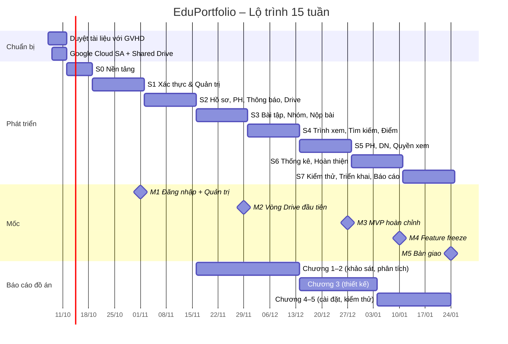

# EduPortfolio – Kế hoạch dự án (Project Plan)

> Phiên bản 2.0 · 07/10/2026
> Tài liệu điều phối chung, liên kết tới: [Requirement](Requirement.md) · [Specification](Specification.md) · [Architecture](Architecture.md) · [DatabaseDesign](DatabaseDesign.md) · [ModulesStructure](ModulesStructure.md) · [ModuleFlows](ModuleFlows.md) · [TechTasks](TechTasks.md)

---

## 1. Tổng quan

| Mục | Nội dung |
|---|---|
| Tên đề tài | Hệ thống quản lý kết quả học tập đa phương tiện của sinh viên (EduPortfolio) |
| Loại | Đồ án tốt nghiệp – ứng dụng web |
| Người dùng | Admin, Giảng viên, Sinh viên, Phụ huynh, Doanh nghiệp |
| Phạm vi | 11 nhóm use case (UC01–UC11), khoảng 90 use case con |
| Công nghệ | React + Vite + Ant Design · NestJS + Prisma · PostgreSQL · Redis/BullMQ · Socket.IO · Google Drive API (Service Account) · Docker Compose |
| Thời gian | 12/10/2026 – 24/01/2027 (15 tuần, 8 sprint) |
| Nguồn lực | 1 sinh viên thực hiện (~30 giờ/tuần), 1 giảng viên hướng dẫn (GVHD) |

### 1.1. Mục tiêu

1. Hoàn thành 100% use case mức P1 (MVP) trước **27/12/2026**.
2. Hoàn thành use case mức P2 và đóng băng tính năng trước **10/01/2027**.
3. Hệ thống chạy ổn định trên server thật, có HTTPS, dữ liệu demo và Shared Drive thật để bảo vệ.
4. Có test tự động: unit + API e2e (≥ 70% coverage ở service lõi) + 8 kịch bản E2E UI.
5. Bộ tài liệu (8 tài liệu này + báo cáo đồ án + hướng dẫn sử dụng) khớp với sản phẩm cuối.

### 1.2. Sản phẩm bàn giao

| # | Sản phẩm | Hạn |
|---|---|---|
| D1 | Bộ tài liệu phân tích – thiết kế (thư mục `docs/`) | 11/10/2026 (bản 2.0), cập nhật liên tục |
| D2 | Mã nguồn monorepo trên GitHub (private, mời GVHD) | Liên tục |
| D3 | Bản demo staging (URL HTTPS) | Từ cuối Sprint 3, cập nhật mỗi sprint |
| D4 | Bản production + dữ liệu seed + tài khoản demo | 18/01/2027 |
| D5 | Hướng dẫn sử dụng theo vai trò + hướng dẫn cài đặt | 22/01/2027 |
| D6 | Báo cáo đồ án (Word/PDF) | 24/01/2027 |
| D7 | Slide bảo vệ + video demo dự phòng | 24/01/2027 |

## 2. Giả định & ràng buộc

| # | Giả định / Ràng buộc | Nếu sai thì |
|---|---|---|
| A1 | Mốc nộp đồ án khoảng cuối tháng 01/2027 | Co giãn S6/S7; nếu ngắn hơn 3 tuần thì bỏ P2 theo thứ tự §3.3 |
| A2 | Có tài khoản Google Workspace (trường hoặc tự tạo bản dùng thử) để có **Shared Drive** | Chuyển sang phương án OAuth của GV (rủi ro R1) |
| A3 | Có VPS (≥ 2 vCPU, 4 GB RAM) và tên miền | Dùng máy cá nhân + Cloudflare Tunnel cho demo |
| A4 | Làm một mình, khoảng 30 giờ/tuần | Giảm phạm vi P2 |
| A5 | GVHD duyệt bộ tài liệu này làm phạm vi chính thức | Cập nhật Requirement + TechTasks, đánh giá lại tiến độ |
| A6 | Điểm và GPA nhập tay, không tích hợp phần mềm đào tạo | – |

## 3. Phạm vi

### 3.1. MVP (P1) – xong cuối Sprint 5

| Nhóm | Use case P1 |
|---|---|
| UC01 | Đăng nhập (2 kiểu), chọn con, đổi mật khẩu lần đầu, đổi mật khẩu, đăng xuất, đăng ký DN |
| UC02 | Tài khoản GV/SV, import SV, danh mục, duyệt DN, học kỳ/môn, LHP + trùng lịch, xếp SV |
| UC03 | Khai báo/cập nhật hồ sơ, đồng bộ PH, công tắc cho DN tìm |
| UC04 | Liên kết Drive, tạo bài tập (thư mục + kiểm tra quyền), sửa/đóng/xóa, điều chỉnh thành viên, SV xem bài tập |
| UC05 | Toàn bộ |
| UC06 | Nộp chung/cá nhân, ghi Drive, nộp lại, xóa nhiều tệp, xem, tìm, đồng bộ lại, nhắc hạn |
| UC07 | Chấm, điểm riêng thành viên, nhập/xem/công bố điểm, yêu cầu sửa điểm + xử lý, SV xem điểm |
| UC08 | Chọn con, điểm/GPA/CPA, bài nộp |
| UC09 | Tìm SV, hồ sơ tóm tắt, gửi yêu cầu, trạng thái, xem bài, nhật ký truy cập, duyệt, thu hồi, tự hết hạn |
| UC10 | Dashboard Admin, thống kê LHP |
| UC11 | Chuông thông báo, email, thông báo tự động |

### 3.2. P2 – Sprint 5–6

Quên mật khẩu · Quản lý PH + đổi SĐT PH · Nhật ký hệ thống · Cấu hình hệ thống (giao diện) · Đổi thư mục nhận bài · Yêu cầu làm lại · Lịch sử nộp bài · Cảnh báo học tập cho PH · SV xem DN đã xem mình · Thống kê DN, SV, DN mình · Xuất báo cáo.

### 3.3. Thứ tự cắt giảm khi trễ

Nếu chậm tiến độ thì bỏ dần từ trên xuống (mỗi mục tiết kiệm được khoảng 3–8 giờ):

1. Xuất PDF (giữ Excel)
2. Đổi thư mục nhận bài khi đã có bài nộp (chỉ cho đổi khi chưa có bài)
3. Thống kê DN chi tiết (giữ 5 chỉ số chính)
4. Kiểm tra định kỳ `verify-files` / `health-check`
5. Nhập điểm bằng Excel
6. Cảnh báo `GPA_DROP`

Mọi P1 giữ nguyên.

## 4. Phương pháp làm việc

- **Scrum rút gọn**, sprint 2 tuần (Sprint 0 dài 1 tuần).
- **Bảng công việc:** GitHub Projects, cột *Backlog → Sprint → Đang làm → Review → Xong*; mỗi task ở [TechTasks](TechTasks.md) là một issue có nhãn `UC0x`, `P1/P2`, `be/fe/infra`.
- **Đầu sprint (thứ Hai):** chọn task, ước lượng lại, cập nhật mục tiêu sprint.
- **Cuối sprint (Chủ nhật):** tự demo trên staging, ghi lại kết quả, retro ngắn (giữ / bỏ / thử).
- **Họp GVHD:** 1 lần/2 tuần (cuối sprint), gửi báo cáo theo mẫu ở §12 trước 1 ngày.
- **Nhánh git:** `main` (luôn deploy được) ← `feature/<task-id>-<mô-tả>`; merge bằng PR, CI phải xanh. Người thực hiện tự commit.
- **Đánh phiên bản:** tag `v0.<sprint>.0` cuối mỗi sprint; `v1.0.0` khi bàn giao.

## 5. Lộ trình

### 5.1. Biểu đồ Gantt



### 5.2. Chi tiết từng sprint

#### Chuẩn bị (07/10 – 11/10/2026)
- Gửi bộ tài liệu cho GVHD, chốt các câu hỏi ở §13.
- Tạo Google Cloud project → bật Drive API → tạo Service Account → tải khóa JSON (lưu ngoài repo).
- Tạo Shared Drive thử nghiệm, thêm SA quyền *Content manager*, thử tải 1 tệp bằng script nhỏ (**spike quan trọng nhất**, phải xong trước S0 để loại rủi ro R1).
- Thuê VPS + tên miền (có thể dời tới S3).

#### Sprint 0 – Nền tảng (12/10 – 18/10)
- **Mục tiêu:** khung dự án chạy được, schema CSDL đầy đủ.
- **Task:** T-001 – T-007.
- **Đầu ra:** repo, `pnpm dev`, migration tạo đủ 46 bảng, trang đăng nhập rỗng.

#### Sprint 1 – Xác thực & Quản trị cơ bản (19/10 – 01/11)
- **Mục tiêu:** Admin dựng được dữ liệu nền; mọi vai trò đăng nhập được.
- **Task:** T-008, T-101 – T-111.
- **Demo GVHD:** đăng nhập, đổi mật khẩu bắt buộc, danh mục, LHP có kiểm tra trùng lịch, import 100 SV.
- **Mốc M1.**

#### Sprint 2 – Hồ sơ, phụ huynh, thông báo, Drive (02/11 – 15/11)
- **Mục tiêu:** hồ sơ SV sinh tài khoản PH; GV kết nối Drive và tạo được bài tập.
- **Task:** T-201 – T-212.
- **Demo GVHD:** SV khai báo hồ sơ → PH đăng nhập bằng SĐT; GV liên kết Shared Drive → tạo bài → thư mục xuất hiện trên Drive; chuông thông báo.

#### Sprint 3 – Bài tập, nhóm, đề tài, nộp bài (16/11 – 29/11)
- **Mục tiêu:** vòng nghiệp vụ lõi chạy end-to-end trên Drive thật.
- **Task:** T-301 – T-310.
- **Demo GVHD:** lập nhóm (mời MSSV + mã mời), đăng ký đề tài + từ khóa, nộp ảnh/video → tệp nằm đúng `Nhom01_<Ten>/Bai_chung`.
- **Mốc M2.** Dựng staging từ sprint này (có thể kéo T-703 phần hạ tầng lên sớm).

#### Sprint 4 – Trình xem, tìm kiếm, chấm & nhập điểm (30/11 – 13/12)
- **Mục tiêu:** GV xem bài đa phương tiện, chấm và công bố điểm.
- **Task:** T-401 – T-410.
- **Demo GVHD:** nộp với tiến trình và cập nhật real-time giữa 2 thành viên; trình chiếu ảnh và tua video; tìm bài theo chủ đề không dấu; chấm nhóm + ghi đè; công bố → SV thấy CPA.

#### Sprint 5 – PH, DN, quyền xem, độ bền Drive (14/12 – 27/12)
- **Mục tiêu:** đủ mọi use case P1.
- **Task:** T-501 – T-511.
- **Demo GVHD:** PH xem điểm/bài của con; DN tìm SV → yêu cầu → Admin duyệt → DN xem → hết hạn (thu ngắn thời gian bằng cấu hình demo); ngắt quyền Drive để thấy cơ chế giữ tạm + đồng bộ lại.
- **Mốc M3 – MVP.**

#### Sprint 6 – Thống kê, báo cáo, hoàn thiện (28/12/2026 – 10/01/2027)
- **Mục tiêu:** đủ 11 nhóm use case, giao diện hoàn thiện, đạt hiệu năng.
- **Task:** T-601 – T-610.
- **Demo GVHD:** dashboard, thống kê DN/LHP, xuất Excel/PDF; kết quả đo tải.
- **Mốc M4 – Feature freeze:** sau mốc này chỉ sửa lỗi.

#### Sprint 7 – Kiểm thử, triển khai, báo cáo (11/01 – 24/01/2027)
- **Mục tiêu:** sản phẩm và hồ sơ sẵn sàng bảo vệ.
- **Task:** T-701 – T-707.
- **Mốc M5 – Bàn giao.**

## 6. Mốc kiểm soát

| Mốc | Ngày | Tiêu chí đạt | Nếu không đạt |
|---|---|---|---|
| M0 Spike Drive | 11/10/2026 | SA tải được 1 tệp 50 MB vào Shared Drive bằng resumable upload | Chuyển ngay sang phương án OAuth (R1), cộng 6 giờ vào S2 |
| M1 | 01/11/2026 | UC01 (trừ quên mật khẩu), UC02.1–2.3, 2.6, 2.8–2.11 chạy được; CI xanh | Dời T-111 sang S2, bỏ 1 mục P2 |
| M2 | 29/11/2026 | Vòng giao bài → nhóm → đề tài → nộp → Drive chạy trên staging | Dừng mọi việc khác để gỡ; báo GVHD |
| M3 | 27/12/2026 | Đủ use case P1, e2e API cho luồng chính xanh | Cắt P2 theo §3.3 |
| M4 | 10/01/2027 | Đủ use case; không còn lỗi mức nghiêm trọng | Feature freeze ngay, phần còn lại ghi vào "hướng phát triển" |
| M5 | 24/01/2027 | D4–D7 hoàn tất | – |

## 7. Quản lý rủi ro

Thang điểm: Xác suất (X) và Ảnh hưởng (A) từ 1 đến 3; Mức = X × A.

| # | Rủi ro | X | A | Mức | Phòng ngừa | Ứng phó |
|---|---|---|---|---|---|---|
| R1 | Không có Shared Drive, SA không ghi được tệp vào My Drive (`storageQuotaExceeded`) | 2 | 3 | **6** | Spike M0; xin tài khoản Workspace của trường; `DriveClientFactory` đã tách sẵn | Thêm chế độ OAuth của GV (scope `drive.file`, lưu refresh token mã hóa), khoảng 6–8 giờ |
| R2 | Trễ tiến độ do làm một mình, ước lượng thiếu | 3 | 2 | **6** | Dự phòng 12 giờ ở S7; theo dõi burndown; cắt giảm theo §3.3 | Báo GVHD sớm, cắt P2 |
| R3 | Quota/giới hạn tốc độ Drive API lúc cao điểm nộp bài | 2 | 2 | 4 | Hàng đợi có limiter, backoff, nộp bất đồng bộ | Tăng chu kỳ thử lại, tạm phục vụ tệp từ bản cục bộ |
| R4 | Đầy ổ đĩa VPS vì tệp tạm/video | 2 | 2 | 4 | Job dọn dẹp, cache 7 ngày, cảnh báo dung lượng trên Uptime Kuma | Giảm thời gian giữ cache, nâng ổ đĩa |
| R5 | Băng thông VPS khi stream video qua proxy | 2 | 2 | 4 | Range request, thumbnail; giới hạn video 500 MB | Phục vụ từ cache cục bộ; chấp nhận giới hạn khi demo |
| R6 | Lỗi bảo mật phân quyền (lộ bài cá nhân, DN xem quá hạn) | 2 | 3 | **6** | Policy tập trung + test bảng chân trị; kiểm tra `expires_at > now()` ở mọi lần truy cập | Hotfix, rà lại checklist T-607 |
| R7 | Yêu cầu thay đổi từ GVHD giữa chừng | 2 | 2 | 4 | Chốt phạm vi bằng bộ tài liệu này (A5) | Đổi lấy bằng cách bỏ mục P2 tương đương |
| R8 | Logic nhóm/nộp bài lỗi do cạnh tranh (race condition) | 2 | 2 | 4 | `SELECT FOR UPDATE`, unique index, test song song | Sửa và thêm test hồi quy |
| R9 | Tìm kiếm tiếng Việt kém chính xác | 1 | 2 | 2 | `unaccent` + `pg_trgm` + `word_similarity`, thử với dữ liệu thật | Chỉnh ngưỡng, thêm `ILIKE` dự phòng |
| R10 | Sự cố server ngày bảo vệ | 1 | 3 | 3 | Bản chạy local bằng Docker Compose + video demo | Chuyển sang bản local |
| R11 | Email bị chặn hoặc vào spam | 2 | 1 | 2 | SMTP có SPF/DKIM (Brevo) | Demo bằng thông báo trong ứng dụng |
| R12 | Vi phạm quy định dữ liệu cá nhân khi dùng dữ liệu thật | 1 | 3 | 3 | Seed dữ liệu giả; SĐT thật chỉ dùng khi UAT có đồng ý | Xóa dữ liệu, dùng dữ liệu giả |

## 8. Kế hoạch kiểm thử

### 8.1. Các mức kiểm thử

| Mức | Công cụ | Phạm vi | Khi chạy |
|---|---|---|---|
| Unit | Vitest | `shared/grading`, policy, service thuần (sync PH, trùng lịch, GPA, tính trạng thái) | Mỗi commit (CI) |
| Integration / API e2e | Jest + Supertest + Testcontainers (Postgres, Redis thật), `FakeDriveService` | Mọi endpoint P1: đường thành công + ngoại lệ chính + phân quyền | Mỗi PR |
| Drive thật | Script `pnpm test:drive` trên Shared Drive test | Tạo thư mục, upload resumable, trash, copy, lỗi quyền | Thủ công cuối S2, S3, S5 |
| E2E UI | Playwright | 8 kịch bản ở T-701 | Cuối S6, S7 |
| Hiệu năng | k6 + dữ liệu giả 10⁴ SV / 10⁵ bài | Tìm SV (DN), tìm bài, xem bài, nộp bài | S6 |
| Bảo mật | Checklist OWASP ASVS L1 rút gọn, OWASP ZAP baseline | Auth, phân quyền, upload, header | S6 |
| UAT | 3–5 người dùng thật | Kịch bản theo vai trò | S7 |

### 8.2. Ca kiểm thử trọng yếu (phải có test tự động)

| # | Ca kiểm thử | UC |
|---|---|---|
| TC-01 | Sai mật khẩu 5 lần thì bị khóa 15 phút; đúng mật khẩu khi đang khóa vẫn bị từ chối | 01.1 |
| TC-02 | Refresh token cũ bị dùng lại thì cả họ token bị thu hồi | 01.1 |
| TC-03 | Hai SV khai cùng SĐT mẹ thì có 1 tài khoản PH, 2 liên kết; một SV đổi số thì PH vẫn còn 1 con | 03.3 |
| TC-04 | LHP cùng GV, cùng thứ, tiết 3–5 với tiết 5–7 thì báo trùng; tiết 1–2 với 3–4 thì không trùng | 02.11 |
| TC-05 | Hai SV cùng chấp nhận lời mời vào chỗ cuối cùng: đúng 1 người thành công | 05.3 |
| TC-06 | SV không có đề tài thì không nộp được; quá hạn thì không nộp được; đã chấm thì không nộp lại được trừ khi GV trả bài | 06.1, 06.4 |
| TC-07 | Tệp `.jpg` có nội dung là `.exe` bị từ chối | 06.1 |
| TC-08 | Nộp lại thì tệp cũ ẩn ngay, job trash được tạo, `version` tăng, sự kiện ghi đủ tên tệp | 06.4 |
| TC-09 | Drive trả 403 thì tệp `FAILED`, bài vẫn "đã nộp", GV nhận thông báo; cấp lại quyền thì retry đưa tệp về `SYNCED` | 06.3, 06.9 |
| TC-10 | Bảng chân trị `canViewSubmission` cho 5 vai trò × 2 loại bài × các tình huống sở hữu | 06.7 |
| TC-11 | DN xem bài khi quyền còn 1 giây thì được; quá hạn 1 giây thì 403 dù job chưa chạy | 09.5 |
| TC-12 | DN không thể gửi yêu cầu thứ 2 khi yêu cầu cũ còn PENDING/APPROVED | 09.3 |
| TC-13 | Tìm SV: SV `discoverable=false` không xuất hiện; thứ tự CPA ↓, số đề tài ↓, MSSV ↑ | 09.1 |
| TC-14 | Response hồ sơ DN không chứa phone/email/parent/điểm chi tiết (snapshot) | 09.2 |
| TC-15 | Tính tổng kết, điểm chữ, hệ 4 đúng ở các mốc biên 3,95 / 4,0 / 8,45 / 8,5 | 07.4 |
| TC-16 | CPA lấy lần học cao nhất của môn học lại | 07.6 |
| TC-17 | Sửa điểm sau khóa: GV không PATCH trực tiếp được; Admin duyệt thì điểm đổi, có audit, CPA tính lại | 07.7, 07.8 |
| TC-18 | Bộ hẹn giờ qua hạn: nhóm khóa, lời mời hủy, mã mời vô hiệu, PH nhận cảnh báo SV chưa nộp; chạy lại không tạo trùng | 05.10, 06.10 |
| TC-19 | Nhắc hạn 24h gửi đúng 1 lần cho mỗi SV chưa nộp | 06.10 |
| TC-20 | PH chọn con A rồi gọi API xem bài của con B (không liên kết) thì 403 | 08.3 |

### 8.3. Tiêu chí kiểm thử đạt

- 100% ca TC-01 – TC-20 xanh.
- Coverage ≥ 70% ở `auth`, `profile`, `groups`, `submissions`, `files`, `grading`, `enterprise`, `access-control`.
- Không còn lỗi mức Nghiêm trọng/Cao khi bàn giao; lỗi mức Trung bình có ghi chú.
- NFR-01: p95 tìm SV < 3 s với 10⁴ SV; trang thông thường < 2 s.

## 9. Môi trường & chi phí

| Hạng mục | Lựa chọn | Chi phí tham khảo |
|---|---|---|
| VPS | 2 vCPU / 4 GB / 80 GB SSD (nhà cung cấp trong nước hoặc Hetzner/DigitalOcean) | ~150.000 – 250.000 đ/tháng × 4 tháng |
| Tên miền | `.id.vn` (miễn phí cho cá nhân 18–23 tuổi) hoặc `.com` | 0 – 300.000 đ/năm |
| Google Workspace | Tài khoản trường; nếu không có thì bản dùng thử Business Starter 14 ngày | 0 (nếu dùng tài khoản trường) |
| Google Cloud (Drive API) | Miễn phí trong hạn mức | 0 |
| Email | Brevo free (300 mail/ngày) | 0 |
| GitHub, Actions, GHCR | Gói miễn phí (repo private có 2.000 phút CI/tháng) | 0 |
| **Tổng ước tính** | | **~0,6 – 1,3 triệu đồng** |

## 10. Khung báo cáo đồ án

| Chương | Nội dung | Nguồn tài liệu |
|---|---|---|
| Mở đầu | Lý do chọn đề tài, mục tiêu, phạm vi, phương pháp | Requirement §1–2, Plan §1 |
| 1. Cơ sở lý thuyết & công nghệ | Hệ thống quản lý học tập, e-portfolio; React, NestJS, PostgreSQL (trigram, unaccent), BullMQ, WebSocket, Google Drive API, JWT, RBAC | Architecture §2 |
| 2. Khảo sát & phân tích yêu cầu | Hiện trạng, tác nhân, 11 sơ đồ use case, đặc tả use case chính, yêu cầu phi chức năng, quy tắc nghiệp vụ | Requirement, Specification §6 |
| 3. Thiết kế hệ thống | Kiến trúc tổng thể, triển khai, tích hợp Drive, CSDL (ERD, bảng), sơ đồ tuần tự, máy trạng thái, thiết kế API, giao diện | Architecture, DatabaseDesign, ModuleFlows, ModulesStructure, Specification §4 |
| 4. Cài đặt | Cấu trúc mã nguồn, các điểm kỹ thuật nổi bật (đồng bộ Drive bất đồng bộ, upload tải tiếp, phân quyền, tìm kiếm không dấu, xử lý cạnh tranh), ảnh màn hình | ModulesStructure, TechTasks |
| 5. Kiểm thử & đánh giá | Chiến lược, kết quả test tự động, hiệu năng, UAT, đánh giá so với mục tiêu | Plan §8 |
| Kết luận | Kết quả đạt được, hạn chế, hướng phát triển | Requirement §9 |

## 11. Kịch bản demo bảo vệ (15 phút)

| Phút | Vai trò | Nội dung |
|---|---|---|
| 0–1 | – | Giới thiệu bài toán, kiến trúc (1 slide) |
| 1–3 | Admin | Dashboard; LHP với lịch học (cố ý tạo trùng lịch để thấy cảnh báo); import SV |
| 3–5 | GV | Liên kết Shared Drive; tạo bài tập nhóm 2–4 người → mở Drive cho thấy thư mục mới |
| 5–8 | SV A, SV B (2 cửa sổ) | A tạo nhóm, mời B bằng MSSV; B chấp nhận; nhập đề tài + từ khóa; A nộp 5 ảnh + video, B thấy cập nhật real-time; A xóa 2 ảnh cùng lúc; mở Drive thấy tệp đúng thư mục |
| 8–10 | GV | Trình chiếu ảnh, tua video; chấm nhóm, ghi đè điểm B; nhập điểm học phần, công bố |
| 10–11 | PH | Đăng nhập bằng SĐT, chọn con, xem CPA, bài nộp, cảnh báo |
| 11–13 | DN → Admin → DN | Tìm SV theo từ khóa không dấu, CPA; gửi yêu cầu; Admin duyệt; DN xem bài; SV thấy "DN đã xem tôi" |
| 13–14 | Admin | Thống kê DN, xuất Excel |
| 14–15 | – | Kết quả kiểm thử, hạn chế, hướng phát triển |

Chuẩn bị: tài khoản demo cho từng vai trò, cấu hình `viewRequest` rút ngắn thời hạn trên bản demo để minh họa hết hạn, video quay sẵn toàn bộ kịch bản.

## 12. Theo dõi tiến độ

### 12.1. Chỉ số theo dõi

| Chỉ số | Cách đo | Ngưỡng cảnh báo |
|---|---|---|
| Burndown giờ | Giờ còn lại / sprint | Lệch > 20% giữa sprint |
| Tỉ lệ task xong | Task ☑ / task kế hoạch | < 80% cuối sprint |
| Lỗi mở | Issue nhãn `bug` | > 10 lỗi Cao |
| CI | Trạng thái nhánh `main` | Đỏ quá 1 ngày |
| Coverage | Báo cáo Jest/Vitest | < 60% ở service lõi |

### 12.2. Mẫu báo cáo gửi GVHD (2 tuần/lần)

```markdown
## Báo cáo Sprint N (dd/mm – dd/mm)
**Mục tiêu sprint:** ...
**Hoàn thành:** T-xxx, T-yyy (link demo / ảnh)
**Chưa xong & lý do:** ...
**Rủi ro / vướng mắc cần thầy/cô hỗ trợ:** ...
**Thay đổi phạm vi đề xuất:** ...
**Kế hoạch sprint N+1:** ...
**Số liệu:** giờ thực tế/kế hoạch, số test, coverage, lỗi mở
```

## 13. Câu hỏi cần chốt với GVHD (trước 11/10/2026)

| # | Câu hỏi | Đề xuất mặc định (đã áp dụng trong tài liệu) |
|---|---|---|
| Q1 | Trường có cấp Google Workspace / Shared Drive cho GV và SV làm đồ án không? | Dùng SA + Shared Drive; dự phòng OAuth |
| Q2 | Mật khẩu PH = SĐT và bắt buộc đổi lần đầu có chấp nhận được không? | Có (D1) |
| Q3 | Bài cá nhân trong bài tập nhóm dùng để làm gì, chấm thế nào? | Nộp phần việc riêng; điểm ghi đè cá nhân (D4) |
| Q4 | DN xem bài có cần SV đồng ý không? | Không; SV kiểm soát bằng công tắc tìm kiếm + xem lịch sử (D7) |
| Q5 | GV có được tìm bài ở LHP của GV khác không? | Mặc định không, cấu hình được theo khoa (D8) |
| Q6 | Cần duyệt đề tài không? Có cho trùng đề tài trong lớp không? | Không duyệt; cho trùng nhưng cảnh báo (D12) |
| Q7 | Mốc nộp đồ án chính xác là ngày nào? | Giả định 24/01/2027 |
| Q8 | Có cần tích hợp với phần mềm đào tạo của trường không? | Không (D10) |

## 14. Bảng nghiệm thu theo nhóm use case

| Nhóm | Tiêu chí nghiệm thu | Kịch bản E2E | Đạt |
|---|---|---|---|
| UC01 | Đăng nhập 5 vai trò; khóa sau 5 lần sai; đổi mật khẩu lần đầu; PH chọn con; DN đăng ký → chờ duyệt | #1 | ☐ |
| UC02 | Tạo đủ dữ liệu nền qua giao diện; import SV có báo lỗi; chặn trùng lịch; duyệt DN; xem log | #1 | ☐ |
| UC03 | Hồ sơ bắt buộc; PH tự sinh/liên kết/gỡ đúng; công tắc DN có hiệu lực ngay | #2 | ☐ |
| UC04 | Kiểm tra quyền ghi phát hiện đủ 5 lỗi; thư mục tạo đúng; sửa/đóng/xóa đúng ràng buộc; đổi thư mục chép đủ tệp | #3 | ☐ |
| UC05 | Mời MSSV/mã; ràng buộc cùng LHP, đủ người, 1 nhóm/bài; chuyển trưởng nhóm; tự khóa khi hết hạn; đề tài + từ khóa + cảnh báo trùng | #3 | ☐ |
| UC06 | Nộp chung/cá nhân, real-time, nộp lại xóa bản cũ, xóa nhiều ảnh, lịch sử; trình chiếu, video tua được; tìm không dấu; lỗi Drive tự phục hồi; nhắc hạn | #3, #4 | ☐ |
| UC07 | Chấm nhóm + ghi đè, trả bài, nhập/tính/công bố điểm, GPA/CPA đúng, sửa điểm qua Admin | #5, #7 | ☐ |
| UC08 | PH chỉ đọc, chỉ con mình, có cảnh báo | #5 | ☐ |
| UC09 | Tìm + sắp xếp đúng; ẩn thông tin nhạy cảm; yêu cầu → duyệt → xem → tự hết hạn; log truy cập; SV xem được DN đã xem | #6 | ☐ |
| UC10 | Số liệu khớp truy vấn đối chứng; xuất Excel/PDF mở được, tiếng Việt đúng | #8 | ☐ |
| UC11 | Chuông real-time, email tới Mailpit/hộp thư thật, không trùng thông báo định kỳ | #3, #6 | ☐ |
